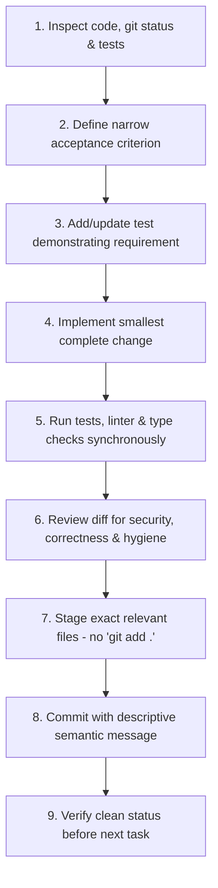

# Agent Development Contract & Workflow Guidelines

This document governs autonomous and assisted agent interactions within the **S&P Sentinel** repository for the **S&P Global & CRISIL Campus Hackathon 2026**. It formally encodes the binding engineering practices defined in **PRD Section 16**.

---

## 1. Principles of Genuine Incremental Development

1. **True Engineering Progression:**
   Every commit must represent an independently meaningful, implemented feature, bug fix, test addition, refactor, or documentation/configuration change. The git history must reflect genuine, stepwise engineering progress—never a single giant dump, and never artificial commits designed to manufacture a narrative.

2. **Strict Academic and Professional Integrity:**
   - No fabricated bugs, fake regressions, backdated timestamps, or forged authorship.
   - No empty commits or splitting finished code retroactively.
   - AI assistance is permitted by the hackathon guidelines (Section 6) when conducted with integrity and full transparency.
   - All code, algorithms, and design choices must be completely explainable by candidate Aman Gupta during evaluation and the live jury pitch.

3. **Mandatory Honesty on Implementation Status:**
   - Never claim an unbuilt feature or future capability is currently operational.
   - Replay datasets must be explicitly badged and labeled as `Historical Replay` or `Synthetic Scenario`.
   - Never invent model benchmarks, false backtest performance metrics, or dummy demonstration links. Unfinished deliverables must remain documented `TODO` items.

4. **Zero Runtime External Dependencies:**
   - The application must operate strictly offline on localhost.
   - No runtime calls to external web APIs, paid cloud services, or external hosted LLMs.
   - Zero hardcoded secrets, API tokens, or credential requirements.

---

## 2. The Required Per-Change Loop

Before and after every code change, the agent must execute the following structured loop:

1. **Inspect:** Examine existing git status, recent commits, and test suite health before modifying files.
2. **Acceptance Criterion:** Formulate a narrow, testable acceptance goal for the change.
3. **Test First / Regression Test:** For behavioral changes or bug fixes, write the unit test first or alongside the fix.
4. **Minimal Complete Implementation:** Write only the code required to satisfy the acceptance criterion.
5. **Synchronous Validation:** Run `pytest`, `ruff check`, and frontend test/build commands immediately to prove correctness.
6. **Review Diff:** Inspect `git diff --staged` to verify no accidental files, secrets, or formatting artifacts were introduced.
7. **Selective Staging:** Stage specific files by path (e.g., `git add src/sentinel/api/app.py`). Never use blind wildcard commands like `git add .` or `git add -A`.
8. **Semantic Commit:** Write clear commit messages conforming to the Conventional Commits specification.
9. **Verify State:** Check `git status` to ensure a clean working tree before proceeding to the next feature.

---

## 3. Commit Message Conventions

Commit messages must reflect actual engineering activities:
- `chore: <description>` — Tooling, repository setup, build scripts, dependency locking.
- `feat(<scope>): <description>` — New verified feature implementation (e.g., `feat(contracts): add pydantic signal schema`).
- `test(<scope>): <description>` — Adding or improving test cases.
- `fix(<scope>): <description>` — Genuine bug fixes (only when a defect actually occurred and was diagnosed).
- `refactor(<scope>): <description>` — Structural refactoring without behavioral alterations.
- `docs(<scope>): <description>` — Documentation, diagrams, architectural specifications.

---

## 4. Failure Handling & Blocker Policy

- If a test or build fails, diagnose root causes truthfully. Fix the issue and verify resolution.
- Never comment out or delete failing assertions simply to make a build pass.
- If an architectural blocker cannot be immediately resolved, commit only the verified components, document the limitation in `docs/assumptions.md`, and inform the user.
