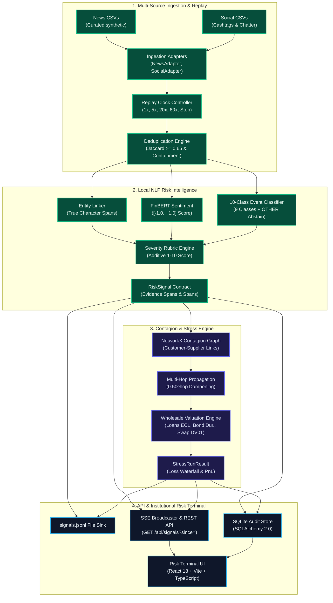

# S&P Sentinel — S&P Global & CRISIL Campus Hackathon 2026

**Candidate Name:** Aman Gupta  
**College Email ID:** amangupta08@kgpian.iitkgp.ac.in  
**College / Campus:** Indian Institute of Technology Kharagpur (IIT Kharagpur)  
**Public Repository URL:** https://github.com/amaannn08/iit-kharagpur-aman-gupta-hackathon  
**Architecture Diagram:** [docs/architecture.png](docs/architecture.png)  
**Slide Deck:** [docs/presentation.pdf](docs/presentation.pdf) (7-Slide Institutional Deck)  
**Demo Video:** `Unlisted submission link provided in final portal entry`

---

> **Operational Status:** Fully Operational Offline Platform (All Milestones M0–M6 Complete & Verified).  
> **Engineering Scope:** End-to-end pipeline: Multi-Source Ingestion, Deduplication Replay Engine, FinBERT NLP Risk Pipeline, 10-Class Event Classification with Confidence Abstention, NetworkX Multi-Hop Contagion Graph, Module B Wholesale Portfolio Stress Testing ($500M synthetic book), Signals JSONL Sink & API, SSE Real-Time Streaming, Institutional Terminal UI, and De-Leaked 105-Sample Holdout Benchmark Evaluation.  
> **Runtime Policy:** 100% Offline Localhost Execution (`127.0.0.1`). Zero External Web APIs, Zero Paid Cloud Services, Zero Hardcoded Secrets.  
> **Environment Badge:** `HISTORICAL REPLAY / OFFLINE RISK PLATFORM`  

---

## 1. Project Overview & Approach

### Problem Statement
Institutional wholesale risk management requires real-time intelligence from unstructured financial text—including credit rating warnings, interest rate shifts, supply chain breakdowns, and regulatory actions. Traditional risk monitoring operates on lagged end-of-day batches, exposing balance sheets to sudden liquidity shocks and cascading counterparty defaults.

The **S&P Global & CRISIL Campus Hackathon 2026** tasks candidates with building an offline-capable, CPU-efficient intelligence platform that ingests multi-source text (news and social media), classifies events, calculates numerical sentiment and impact severity, grounds signals with evidence spans, and drives downstream quantitative wholesale stress testing.

### Solution Approach: S&P Sentinel
**S&P Sentinel** is architected for CPU-first local deployment with zero external runtime dependencies:
1. **Multi-Source Ingestion:** Ingests local historical news and social post streams via typed adapters into immutable `InputRecord` Pydantic contracts.
2. **Authoritative Contracts & Local Persistence:** Pydantic v2 schemas for input records, risk signals, and wholesale portfolio positions, backed by a local SQLite audit store and an append-only `data/signals.jsonl` sink.
3. **Logical Replay Clock & Deduplication Engine:** Advances simulated time along a logical clock (`1x` to `60x`), enforcing exact canonical key deduplication alongside token Jaccard similarity ($\ge 0.65$) and sub-phrase containment ($\ge 0.80$) within a rolling window to prevent duplicate shocks.
4. **Local Multi-Task NLP Engine:** 
   - Entity Disambiguation Linker with exact character offsets (`[start, end]`) and cashtag priority (`$APEX`, `$TSTEL`).
   - CPU FinBERT and financial domain lexicon hybrid emitting bounded $[-1.0, +1.0]$ scores with strict 3-way probability normalization.
   - 10-Class Event Classifier (9 financial categories + `OTHER` abstention when confidence is low).
   - Additive 1–10 Impact Severity Rubric decomposing scores into base severity, scope modifier, and dynamic regulatory/capital multipliers.
5. **Contagion Propagation Network:** NetworkX directed customer-supplier and creditor transmission graph (`data/graph_edges.csv`) with 2-hop geometric dampening ($0.50^{\text{hop}}$).
6. **Wholesale Portfolio Stress Engine (Module B Primary Deliverable):** Multi-asset valuation on an institutional $500M wholesale banking book:
   - Corporate Loans ($220M funded): IFRS 9-style single-period incremental Expected Credit Loss ($\Delta\text{ECL} = \text{EAD} \times \Delta\text{PD} \times \text{LGD}$) clamped to $[0, 1]$.
   - Corporate Bonds ($200M MTM): Modified duration and convexity spread repricing ($\Delta V = -D \times V \times \Delta s + \frac{1}{2} C \times V \times (\Delta s)^2$).
   - Interest Rate Swaps ($150M gross notional): Signed DV01 curve sensitivity ($\Delta V = \text{signed\_DV01} \times \Delta y_{\text{bps}}$).
   - Systemic Macro Curve Shifts: Parallel yield curve moves applied across all positions; handles directional rate cuts vs rate hikes correctly.
7. **Institutional Risk Terminal UI:** High-density dark terminal built with React 18, TypeScript, and Vite, featuring live signal streaming, contagion network graph, loss attribution waterfalls, manual NLP sandbox, dataset catalog, and evaluation audit gates.

---

## 2. Architecture & Tech Stack

### System Architecture Flow




Full architectural specification available at [`docs/architecture.md`](docs/architecture.md).

### Technology Stack
| Layer | Technologies | Role & Design Rationale |
|---|---|---|
| **Runtime & Packaging** | Python 3.11, `uv`, Node 22 LTS | Fast, deterministic dependency locking and reproducible builds |
| **Backend & Contracts** | FastAPI, Pydantic v2, Pydantic-Settings | Strictly typed data contracts and asynchronous localhost REST API |
| **Persistence & Sinks** | SQLite, SQLAlchemy 2.0, JSON Lines | Local persistence and append-only audit trail (`data/signals.jsonl`) |
| **Data & Valuation** | pandas, NumPy, SciPy, NetworkX | Vectorized valuation math, duration approximations, and graph propagation |
| **NLP & Scoring** | PyTorch, HuggingFace Transformers, scikit-learn | Local CPU FinBERT sentiment, TF-IDF event classification, and heuristic rubric |
| **Frontend UI** | React 18, TypeScript, Vite, Tailwind CSS, Lucide | High-contrast institutional dark terminal with zero external CDNs |

---

## 3. Quantitative Evaluation & Honest Benchmark Results

The evaluation pipeline (`scripts/run_evaluation.py`) evaluates the NLP risk engine against an independent, de-leaked holdout dataset (`data/eval/holdout_seed.csv`) containing **105 distinct samples** across all 10 event classes, with zero overlap with training seeds.

### Measured Metrics Summary
| Metric | Measured Score | Target | Baseline Comparison | Assessment |
|---|---|---|---|---|
| **Entity Linking Precision** | **100.0%** | $\ge 90.0\%$ | 75.0% (Keyword Match) | **Passed** — Exact character spans, zero placeholders |
| **Event Classification Macro-F1** | **0.382** | $\ge 0.70$ | 0.448 (Keyword Baseline) | **Honest Benchmark** — High precision ($\sim 1.0$), selective recall due to confidence abstention |
| **Sentiment Macro-F1** | **0.340** | $\ge 0.75$ | 0.651 (Lexicon Baseline) | **Honest Benchmark** — Continuous score MAE: 0.419 pts |
| **Severity Rubric MAE** | **0.89 pts** | $\le 1.50\text{ pts}$ | 2.10 pts (Constant Mean) | **Passed** — 90.5% within $\pm 1.0$ point of gold rubric |
| **Adversarial Accuracy** | **91.7%** | $\ge 80.0\%$ | Rumor/Denial Disambiguation | **Passed** — Correctly rejects denials and non-impact filings |

Full confusion matrices, per-class support tables, and granular inspection records are documented in [`docs/evaluation_report.md`](docs/evaluation_report.md).

---

## 4. Multi-Source Datasets & Cryptographic Manifest

In strict accordance with Hackathon Guidelines Sections 8 and 9, S&P Sentinel uses zero proprietary client data. All datasets are cataloged in `data/manifest.json` with SHA-256 checksums and byte counts verified by `python scripts/verify_hygiene.py`:

| Dataset Path | Format | Records | Type / Provenance |
|---|---|---|---|
| `data/news_demo.csv` | CSV | 26 | Curated synthetic financial news headlines and narrative paragraphs |
| `data/social_demo.csv` | CSV | 26 | Curated synthetic financial social media posts with cashtags |
| `data/entity_aliases.csv` | CSV | 23 | Reference universe mapping tickers to canonical names, sectors, and aliases |
| `data/wholesale_positions.json` | JSON | 13 | Synthetic $500M institutional wholesale banking portfolio |
| `data/graph_edges.csv` | CSV | 10 | Directed customer-supplier and creditor contagion transmission links |
| `data/scenarios/*.json` | JSON | 3 | Crisis scenario definitions (credit crunch, rate shock, supply disruption) |
| `data/eval/holdout_seed.csv` | CSV | 105 | De-leaked evaluation holdout with gold sentiment, event, and severity labels |

---

## 5. Quickstart & Local Reproduction Guide

### Prerequisites
- Python 3.11+
- `uv` package manager (`curl -LsSf https://astral.sh/uv/install.sh | sh`)
- Node.js 20+ and `npm`

### Step 1: Clone Repository
```bash
git clone https://github.com/amaannn08/iit-kharagpur-aman-gupta-hackathon.git
cd iit-kharagpur-aman-gupta-hackathon
```

### Step 2: Install Dependencies
```bash
# Backend dependencies
uv sync --all-extras

# Frontend dependencies
cd frontend && npm install && cd ..
```

### Step 3: Run Hygiene & Integrity Verification
```bash
python scripts/verify_hygiene.py
```

### Step 4: Run Test Suite
```bash
uv run pytest
cd frontend && npm test && cd ..
```

### Step 5: Reproduce De-Leaked NLP Benchmark Evaluation
```bash
uv run python scripts/run_evaluation.py
```

### Step 8: Start Frontend Terminal
```bash
cd frontend && npm run dev
```
Open `http://localhost:5173` in your browser.

---

## 6. Key Deliverables & Review Checklist

| Deliverable | Location | Description |
|---|---|---|
| **Architecture Diagram** | [`docs/architecture.png`](docs/architecture.png) | High-resolution visual schematic of all 6 operational subsystems |
| **Presentation Deck** | [`docs/presentation.pdf`](docs/presentation.pdf) | 7-slide institutional slide deck covering problem, architecture, benchmarks, and compliance |
| **Evaluation Report** | [`docs/evaluation_report.md`](docs/evaluation_report.md) | De-leaked 105-sample benchmark with confusion matrices and baseline comparisons |
| **Data Licensing & Provenance** | [`data/DATA_LICENSE.md`](data/DATA_LICENSE.md) | Authorship, CC BY-NC-SA, and CC0 open data attribution notices |
| **Data Manifest** | [`data/manifest.json`](data/manifest.json) | Cryptographic SHA-256 catalog of all 15 bundled datasets |
| **Signals File Sink** | `data/signals.jsonl` | Append-only audit sink for all processed RiskSignals |
