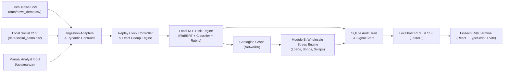

# S&P Sentinel - S&P Global & Crisil Campus Hackathon 2026

**Candidate Name:** Aman Gupta  
**College Email ID:** amangupta08@kgpian.iitkgp.ac.in  
**College / Campus:** Indian Institute of Technology Kharagpur (IIT Kharagpur)  
**Demo Video Link:** `TODO: [YouTube / Unlisted] (recording pending milestone M10)`  
**Slide Deck Link (if hosted externally):** `TODO: /docs/presentation.pdf (slide deck preparation pending milestone M10)`  

---

> **Operational Status:** Milestone M0/M1 Ready (Repository Foundation, Contracts, Data Manifest, Local Health Service, Terminal Shell).  
> **Runtime Policy:** 100% Offline Localhost Execution. Zero External Web APIs, Zero Paid Services, Zero Hardcoded Secrets.  
> **Environment Badge:** `Historical Replay / Synthetic Scenario`  

---

## 1. Project Overview / Problem Statement & Approach

### Problem Statement
Institutional risk management faces an unprecedented deluge of unstructured, real-time information—ranging from breaking macroeconomic updates and central bank decisions to credit downgrades, supplier disruptions, and market commentary. Traditional wholesale risk monitoring operates on lagged end-of-day reports, leaving banks and asset managers vulnerable to sudden liquidity shocks and cross-entity contagion.

The **S&P Global & CRISIL Campus Hackathon 2026** problem statement tasks candidates with building an offline-capable, CPU-efficient intelligence engine that ingests multi-source financial text (news and social media), classifies events, calculates numerical sentiment and impact severity, preserves verifiable evidence, and drives downstream quantitative risk applications.

### Solution Approach: S&P Sentinel
**S&P Sentinel** is an auditable financial-text risk intelligence and portfolio stress-testing platform architected for CPU-first local deployment:
1. **Multi-Source Ingestion & Replay:** Ingests local historical news and social post streams via typed adapters into an auditable logical replay clock with exact deduplication.
2. **Unified NLP Risk Engine:** Extracts entity mentions, scores domain sentiment ($[-1.0, +1.0]$) via local FinBERT, categorizes events into a 9-class taxonomy, and computes an auditable 1–10 severity impact score with textual evidence spans and explicit abstention.
3. **Contagion Knowledge Graph:** Propagates risk through bounded customer-supplier and credit dependency edges (P1).
4. **Wholesale Portfolio Stress Testing (Module B - Primary Deliverable):** Maps event class and severity to transparent risk-factor shocks on a synthetic $500M institutional book (corporate loans via ECL, corporate bonds via modified duration, and interest rate swaps via signed DV01).
5. **Interactive Risk Terminal:** A high-contrast dark-mode terminal built with React, TypeScript, and Tailwind, providing an explainability drawer, portfolio loss waterfall, and scenario stepping.

---

## 2. Architecture & Tech Stack

### System Architecture Flow


High-resolution architecture diagram available at [`docs/architecture.png`](docs/architecture.png).

### Technology Stack
| Layer | Technologies | Role & Design Rationale |
|---|---|---|
| **Runtime & Packaging** | Python 3.11, `uv`, Node 22 LTS | Fast deterministic dependency resolution and reproducible builds |
| **Backend & Contracts** | FastAPI, Pydantic v2, Pydantic-Settings | Strictly typed data contracts and asynchronous localhost REST API |
| **Persistence** | SQLite, SQLAlchemy 2.0 | Zero-dependency local persistence for replay runs, signals, and stress results |
| **Data & Math** | pandas, NumPy, SciPy | Vectorized valuation math, duration approximations, and ECL models |
| **Network & Contagion** | NetworkX | Directed entity dependency and supply-chain exposure modeling |
| **NLP & ML (M3)** | ProsusAI FinBERT, scikit-learn | Local CPU sentiment and multi-class event categorization |
| **Frontend Terminal** | React 19, TypeScript, Vite, Tailwind CSS, Lucide | High-density institutional dark terminal with zero external CDN dependencies |
| **Quality & CI** | pytest, pytest-asyncio, ruff, vitest, GitHub Actions | Automated contract validation, linting, and hygiene verification |

---

## 3. Dataset Used

In strict accordance with Section 8 and Section 9 of the hackathon guidelines:
- **Zero Confidential / Proprietary Data:** No client data, non-public ratings, or proprietary models from S&P Global or CRISIL are used.
- **Authored Synthetic Replay Datasets:** All bundled datasets are authored synthetic records created specifically for this hackathon evaluation, tagged with `is_synthetic: true` and `timestamp_quality: synthetic`.
- **Cryptographic Provenance:** Every file's row count, schema, licensing, and exact SHA-256 checksum are cataloged in [`data/manifest.json`](data/manifest.json).

### Bundled Data Catalog
| File | Records | Description | License |
|---|---|---|---|
| [`data/news_demo.csv`](data/news_demo.csv) | 25 | Structured financial news covering credit downgrades, Fed rate hikes, supply disruptions, antitrust investigations, and earnings. | CC-BY-4.0 (Synthetic) |
| [`data/social_demo.csv`](data/social_demo.csv) | 25 | Financial social commentary with cashtags (`$APEX`, `$QSEM`, `$TSTEL`), trader sentiment, and rumors. | CC-BY-4.0 (Synthetic) |
| [`data/wholesale_positions.json`](data/wholesale_positions.json) | 13 | $500M institutional portfolio across corporate loans ($220M), bonds ($200M), SOFR swaps ($150M gross notional), and cash reserves ($80M). | CC-BY-4.0 (Synthetic) |
| [`data/entity_aliases.csv`](data/entity_aliases.csv) | 23 | Curated ticker-to-company universe with sectors, aliases, cashtags, and ambiguity flags. | CC0 / Public Domain |
| [`data/graph_edges.csv`](data/graph_edges.csv) | 10 | Directed customer-supplier and creditor relationships for contagion propagation. | CC-BY-4.0 (Synthetic) |
| [`data/scenarios/`](data/scenarios/) | 3 | Pre-configured crisis scenarios: Credit Crunch, Macro Rate Shock (+100 bps), and Supply Disruption. | CC-BY-4.0 (Synthetic) |
| [`data/eval/`](data/eval/) | 13 | Standardized 1-10 severity rubric and holdout evaluation seed with gold labels. | CC-BY-4.0 |

---

## 4. Quickstart & Installation

**Tested Environment:** Linux (Ubuntu/Debian, Arch, Fedora) & macOS on Python 3.11 with `uv` and Node 22+.

### Step 1: Clone Repository
```bash
git clone https://github.com/amaannn08/iit-kharagpur-aman-gupta-hackathon.git
cd iit-kharagpur-aman-gupta-hackathon
```

### Step 2: Backend Environment Setup (using `uv`)
```bash
# Create virtual environment with Python 3.11
uv venv --python 3.11 .venv
source .venv/bin/activate

# Install and sync locked backend dependencies
uv sync

# (Optional fallback using standard pip and requirements.txt)
# pip install -r requirements.txt
```

### Step 3: Run Backend Tests
```bash
uv run pytest -v
uv run ruff check .
python scripts/verify_hygiene.py
```

### Step 4: Run Backend Server
```bash
uv run uvicorn sentinel.api.app:app --host 127.0.0.1 --port 8000
```
Verify the health endpoint:
```bash
curl -s http://127.0.0.1:8000/api/health | jq .
```

### Step 5: Frontend Terminal Setup (optional dev mode)
```bash
cd frontend
npm install
npm test
npm run build
npm run dev
```
Navigate to `http://localhost:5173` to interact with the S&P Sentinel terminal.

---

## 5. Key Results & Domain Impact

### What This Foundation Delivers (Milestone M0/M1 Ready)
- **Validated Input-to-Contract Pipeline:** News and social feeds are loaded through typed adapters into immutable `InputRecord` models with 100% preservation of timestamp quality and synthetic markers.
- **$500M Wholesale Banking Book:** Fully modeled balance sheet distinguishing funded debt (loans and bonds) from derivative notional (interest rate swaps) with sensitivity parameters (duration, baseline PD, LGD, signed DV01).
- **FastAPI Smoke-Testable Localhost API:** Verified `/api/health` and `/api/datasets` endpoints returning real metadata and configuration status.
- **Transparent Engineering Hygiene:** Fully automated CI workflow, zero hardcoded secrets, zero external runtime calls, and an auditable commit progression adhering to PRD §16.

### Domain Value & Alignment
S&P Sentinel aligns directly with the core analytical workflows of **S&P Global Ratings** and **CRISIL Credit Market Intelligence**:
- Translating qualitative news sentiment into quantitative credit spread and default probability adjustments.
- Stress-testing balance sheet resilience against multi-factor macroeconomic events without reliance on opaque external cloud LLMs.
- Preserving an unalterable audit trail linking every calculated loss back to specific source sentences and declared financial assumptions.
