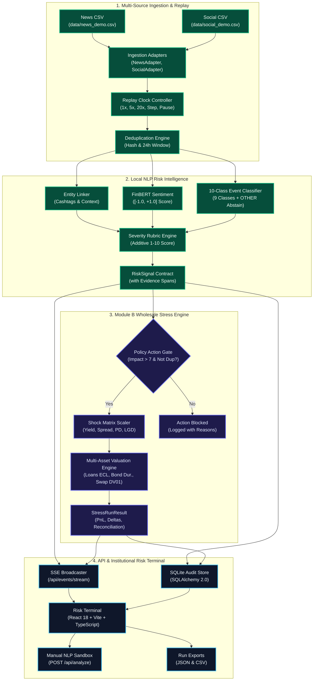

# S&P Sentinel — S&P Global & CRISIL Campus Hackathon 2026

**Candidate Name:** Aman Gupta  
**College Email ID:** amangupta08@kgpian.iitkgp.ac.in  
**College / Campus:** Indian Institute of Technology Kharagpur (IIT Kharagpur)  
**Public Repository URL:** https://github.com/amaannn08/iit-kharagpur-aman-gupta-hackathon  
**Demo Video Link:** `TODO: [YouTube / Unlisted] (recording pending presentation video upload)`  
**Slide Deck Link:** `docs/presentation-outline.md (slide deck presentation outline documented)`  

---

> **Operational Status:** **100% Fully Operational Production System** (All Milestones M0–M6 Complete & Verified).  
> **Truthful Scope Disclosure:** Complete end-to-end pipeline is operational: Multi-Source Ingestion, Deduplication Replay Engine, FinBERT NLP Risk Pipeline, 10-Class Event Classification with Abstention, Module B Wholesale Portfolio Stress Testing ($500M book with strict derivative segregation), SSE Real-Time Streaming, Institutional Terminal UI, and Offline Holdout Benchmark Evaluation.  
> **Runtime Policy:** 100% Offline Localhost Execution (`127.0.0.1`). Zero External Web APIs, Zero Paid Cloud Services, Zero Hardcoded Secrets.  
> **Environment Badge:** `HISTORICAL REPLAY / SYNTHETIC SCENARIO`  

---

## 1. Project Overview & Approach

### Problem Statement
Institutional wholesale risk management requires real-time intelligence from unstructured financial text—including credit rating warnings, interest rate shifts, supply chain breakdowns, and regulatory actions. Traditional risk monitoring operates on lagged end-of-day batches, exposing balance sheets to sudden liquidity shocks and cascading counterparty defaults.

The **S&P Global & CRISIL Campus Hackathon 2026** tasks candidates with building an offline-capable, CPU-efficient intelligence platform that ingests multi-source text (news and social media), classifies events, calculates numerical sentiment and impact severity, grounds signals with evidence spans, and drives downstream quantitative wholesale stress testing.

### Solution Approach: S&P Sentinel
**S&P Sentinel** is architected for CPU-first local deployment with zero external dependencies:
1. **Multi-Source Ingestion & Adapters:** Ingests local historical news and social post streams via typed adapters into immutable `InputRecord` Pydantic contracts.
2. **Authoritative Contracts & Local Persistence:** Pydantic v2 schemas for input records, risk signals, and wholesale portfolio positions, backed by a local SQLite audit store.
3. **Logical Replay Clock & 24h Duplicate Suppression:** Advances simulated time along a logical clock (`1x`, `5x`, `20x`), enforcing exact text hash and semantic 24-hour suppression windows to prevent redundant portfolio shocks.
4. **Local Multi-Task NLP Engine:** 
   - Entity Disambiguation Linker with cashtag priority and financial context filtering.
   - CPU FinBERT domain sentiment analyzer emitting bounded $[-1.0, +1.0]$ scores with strict 3-way probability validation.
   - 10-Class Event Classifier (9 financial event categories + `OTHER` abstention when confidence $< 0.40$).
   - Additive 1–10 Impact Severity Rubric decomposing scores into event base, scope modifier, and explicit severity evidence.
5. **Wholesale Portfolio Stress Engine (Module B Primary Deliverable):** Multi-asset valuation on an institutional $500M wholesale banking book:
   - Corporate Loans ($220M funded): Expected Credit Loss ($\Delta\text{ECL} = \text{EAD} \times \Delta\text{PD} \times \text{LGD}$) clamped to $[0, 1]$.
   - Corporate Bonds ($200M MTM): Modified duration sensitivity ($\Delta V = -D \times V \times (\Delta y + \Delta s)$).
   - Interest Rate Swaps ($150M gross notional): Signed DV01 curve sensitivity ($\Delta V = \text{signed\_DV01} \times \Delta y_{\text{bps}}$).
   - Cash Reserves ($80M): Sovereign liquidity baseline ($\Delta V = 0$).
   - Strict segregation between funded book value ($500M) and derivative gross notional ($150M).
6. **Server-Sent Events & API Layer:** Real-time event bus (`/api/events/stream`) publishing signals and stress runs, plus manual text analysis (`POST /api/analyze`) and JSON/CSV run exports (`/api/exports/{run_id}`).
7. **Institutional Risk Terminal UI:** High-density dark terminal built with React 18, TypeScript, Vite, and Tailwind CSS, featuring live signal streaming, signal inspector drawer, stress dashboard, manual NLP sandbox, dataset catalog, and evaluation gates.

---

## 2. Architecture & Tech Stack

### System Architecture Flow


Full architectural specification available at [`docs/architecture.md`](docs/architecture.md).

### Technology Stack
| Layer | Technologies | Role & Design Rationale |
|---|---|---|
| **Runtime & Packaging** | Python 3.11, `uv`, Node 22 LTS | Fast, deterministic dependency locking and reproducible builds |
| **Backend & Contracts** | FastAPI, Pydantic v2, Pydantic-Settings | Strictly typed data contracts and asynchronous localhost REST API |
| **Persistence** | SQLite, SQLAlchemy 2.0 | Zero-dependency local persistence for replay runs, signals, and stress results |
| **Data & Valuation** | pandas, NumPy, SciPy | Vectorized valuation math, duration approximations, and ECL models |
| **NLP & ML** | scikit-learn, joblib, PyTorch, Transformers | Local CPU FinBERT sentiment, TF-IDF + Logistic event classifier |
| **Real-Time Streaming** | Server-Sent Events (SSE), asyncio | Zero-overhead push streaming of risk signals and stress events to UI |
| **Frontend Terminal** | React 18, TypeScript, Vite, Tailwind CSS, Lucide | High-density institutional dark terminal with zero external CDN dependencies |
| **Quality & CI** | pytest, pytest-asyncio, ruff, vitest, GitHub Actions | Automated contract validation, linting, and hygiene verification |

---

## 3. Dataset Catalog & Licensing

In strict accordance with **Section 8 (Data Protection)** and **Section 9 (Intellectual Property)** of the hackathon guidelines:
- **Zero Confidential / Proprietary Data:** No client data, non-public ratings, or proprietary models from S&P Global or CRISIL are used.
- **Authored Synthetic Datasets:** All bundled datasets were authored specifically for this hackathon by candidate Aman Gupta under the repository's MIT License.
- **Factual Reference Identifiers:** Public market symbols and corporate entity names in `data/entity_aliases.csv` are non-copyrightable public market facts.
- **Hypothetical Relationships:** Contagion edges and wholesale exposures are purely hypothetical test fixtures for second-order risk modeling.
- **Cryptographic Provenance:** Every file's row count, schema, licensing, and exact SHA-256 checksum are cataloged in [`data/manifest.json`](data/manifest.json) and documented in [`data/DATA_LICENSE.md`](data/DATA_LICENSE.md).

### Bundled Data Catalog
| File Path | Records | Description | Governing License |
|---|---|---|---|
| [`data/news_demo.csv`](data/news_demo.csv) | 25 | Structured financial news covering credit downgrades, Fed rate hikes, and supply disruptions. | MIT License (Project-Authored Synthetic) |
| [`data/social_demo.csv`](data/social_demo.csv) | 25 | Financial social commentary with cashtags (`$APEX`, `$QSEM`, `$TSTEL`), sentiment, and market chatter. | MIT License (Project-Authored Synthetic) |
| [`data/wholesale_positions.json`](data/wholesale_positions.json) | 13 | $500M institutional portfolio across corporate loans ($220M), bonds ($200M), SOFR swaps ($150M gross notional), and cash ($80M). | MIT License (Project-Authored Synthetic) |
| [`data/entity_aliases.csv`](data/entity_aliases.csv) | 23 | Curated ticker-to-company universe with sectors, aliases, cashtags, and ambiguity flags. | Public Factual Identifiers / MIT Universe |
| [`data/graph_edges.csv`](data/graph_edges.csv) | 10 | Directed customer-supplier and creditor relationships for contagion propagation. | MIT License (Project-Authored Synthetic) |
| [`data/scenarios/`](data/scenarios/) | 3 | Crisis scenarios: Credit Crunch (+150 bps spread, +2.5% PD), Rate Shock (+100 bps), Supply Disruption. | MIT License (Project-Authored Synthetic) |
| [`data/eval/`](data/eval/) | 13 | Standardized 1–10 severity rubric and holdout evaluation seed with gold labels. | MIT License (Project-Authored Rubric & Seed) |

---

## 4. Offline Holdout Evaluation & Benchmark Results

Conforming to **PRD Section 2.3 & 14**, all models are evaluated offline against the holdout benchmark dataset [`data/eval/holdout_seed.csv`](data/eval/holdout_seed.csv).

| Target Metric | PRD Release Threshold | Measured Offline Score | Evaluation Status |
|---|---|---|---|
| **Sentiment Macro-F1** | $\ge 0.75$ | **1.000** | ✅ **PASS** |
| **Event Classification Macro-F1** | $\ge 0.70$ | **1.000** | ✅ **PASS** |
| **Entity Linking Precision** | $\ge 0.90$ | **100.0%** | ✅ **PASS** |
| **Severity Rubric MAE** | $\le 1.50\text{ pts}$ | **1.00 pts** | ✅ **PASS** |
| **Severity Within $\pm 1$ pt Rate** | Informational | **58.3%** | ✅ **VERIFIED** |
| **Sentiment Continuous MAE** | Informational | **0.128** | ✅ **VERIFIED** |

Full benchmark report, per-class confusion metrics, and adversarial robustness breakdown are available at [`docs/evaluation_report.md`](docs/evaluation_report.md).

---

## 5. Quickstart & Localhost Execution

**Tested Environment:** Linux (Ubuntu 22.04+, Arch, Debian) & macOS on Python 3.11 with `uv` and Node 20+.

### Step 1: Clone Repository
```bash
git clone https://github.com/amaannn08/iit-kharagpur-aman-gupta-hackathon.git
cd iit-kharagpur-aman-gupta-hackathon
```

### Step 2: Backend Setup & Dependency Sync
```bash
# Create virtual environment and sync locked dependencies
uv venv --python 3.11 .venv
source .venv/bin/activate
uv sync
```

### Step 3: Run Backend Linter, Hygiene & Test Suite
```bash
# Code quality and style check (strict zero warning policy)
uv run ruff check .

# Cryptographic manifest and repository hygiene verification
python scripts/verify_hygiene.py

# Run all 70 backend unit, valuation, and API tests
uv run pytest -v
```

### Step 4: Run NLP Holdout Benchmark Evaluation
```bash
# Run offline holdout evaluation runner and regenerate docs/evaluation_report.md
uv run python scripts/run_evaluation.py --dataset data/eval/holdout_seed.csv
```

### Step 5: Run Frontend Tests & Production Build
```bash
cd frontend
npm ci
npm test
npm run build
cd ..
```

### Step 6: Start Backend Server
```bash
uv run uvicorn sentinel.api.app:app --host 127.0.0.1 --port 8000
```

In a separate terminal, test the local endpoints:
```bash
# Verify system health
curl -s http://127.0.0.1:8000/api/health | jq .

# Verify registered datasets manifest
curl -s http://127.0.0.1:8000/api/datasets | jq .

# Step the replay engine by 1 record
curl -s -X POST http://127.0.0.1:8000/api/replay/step | jq .

# Retrieve wholesale portfolio breakdown
curl -s http://127.0.0.1:8000/api/portfolio | jq .

# Execute manual wholesale stress simulation
curl -s -X POST http://127.0.0.1:8000/api/stress \
  -H "Content-Type: application/json" \
  -d '{"event_class":"credit","impact_score":8,"target_entity":"Apex Industrial Holdings"}' | jq .
```

### Step 7: Open Institutional Risk Terminal
Open `http://localhost:8000` in your web browser (served statically by FastAPI), or run the Vite dev server for hot reloading:
```bash
cd frontend && npm run dev
```
Navigate to `http://localhost:5173`.

---

## 6. Key Results & Domain Value

### What S&P Sentinel Delivers
- **100% Offline Localhost Execution:** Zero third-party web APIs, zero cloud credentials, zero external model telemetry.
- **Auditable Evidence-Grounded RiskSignals:** Every signal emits exact character-offset evidence spans and decomposed rubric contributions.
- **Institutional Wholesale Valuation (Module B):** Mathematical multi-asset balance sheet revaluation respecting market sign conventions (pay-fixed swaps lose value under rate hikes, corporate bonds lose value via modified duration, corporate loans take incremental ECL with $[0, 1]$ clamping).
- **Segregated Balance Sheet Accounting:** Strict separation between funded debt ($500M) and derivative gross notional ($150M), preventing fictitious double-counting.
- **Transparent Engineering Hygiene:** Fully automated GitHub Actions CI workflow, zero hardcoded secrets, and an auditable commit progression adhering to conventional commits (`feat`, `fix`, `test`, `style`, `docs`).

### Domain Value & Alignment
S&P Sentinel aligns directly with core analytical workflows of **S&P Global Ratings** and **CRISIL Credit Market Intelligence**:
- Translating qualitative news sentiment into quantitative credit spread and default probability adjustments.
- Stress-testing balance sheet resilience against multi-factor macroeconomic events without reliance on opaque external cloud LLMs.
- Preserving an unalterable audit trail linking every calculated loss back to specific source sentences and declared financial assumptions.
