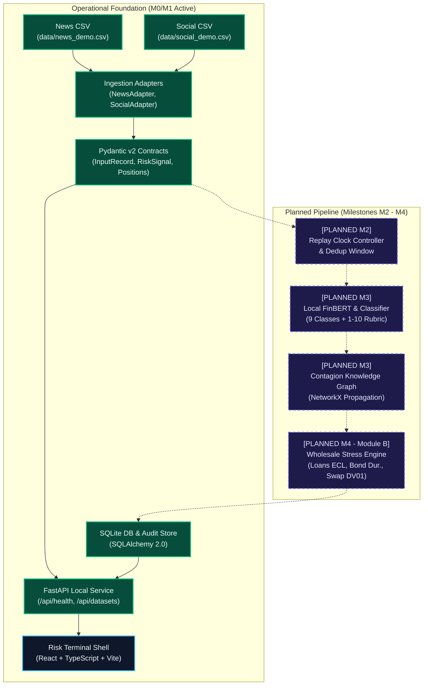

# S&P Sentinel — S&P Global & CRISIL Campus Hackathon 2026

**Candidate Name:** Aman Gupta  
**College Email ID:** amangupta08@kgpian.iitkgp.ac.in  
**College / Campus:** Indian Institute of Technology Kharagpur (IIT Kharagpur)  
**Public Repository URL:** https://github.com/amaannn08/iit-kharagpur-aman-gupta-hackathon  
**Demo Video Link:** `TODO: [YouTube / Unlisted] (recording pending milestone M10)`  
**Slide Deck Link:** `TODO: /docs/presentation.pdf (slide deck preparation pending milestone M10; outline documented in docs/presentation-outline.md)`  

---

> **Operational Status:** Milestone M0/M1 Ready (Repository Foundation, Typed Contracts, Ingestion Adapters, Cryptographic Manifest, Local Health API, Dark Terminal Shell).  
> **Truthful Scope Disclosure:** Only the M0/M1 repository foundation is currently operational. Downstream components (FinBERT NLP sentiment inference, 9-class event categorization, NetworkX contagion propagation, Module B wholesale portfolio stress execution, and Module A) are planned roadmap deliverables (Milestones M2–M5) and are not claimed as operational.  
> **Runtime Policy:** 100% Offline Localhost Execution (`127.0.0.1`). Zero External Web APIs, Zero Paid Cloud Services, Zero Hardcoded Secrets.  
> **Environment Badge:** `HISTORICAL REPLAY / SYNTHETIC SCENARIO`  

---

## 1. Project Overview & Approach

### Problem Statement
Institutional wholesale risk management requires real-time intelligence from unstructured financial text—including credit rating warnings, interest rate shifts, supply chain breakdowns, and regulatory actions. Traditional risk monitoring operates on lagged end-of-day batches, exposing balance sheets to sudden liquidity shocks and cascading counterparty defaults.

The **S&P Global & CRISIL Campus Hackathon 2026** tasks candidates with building an offline-capable, CPU-efficient intelligence platform that ingests multi-source text (news and social media), classifies events, calculates numerical sentiment and impact severity, grounds signals with evidence spans, and drives downstream quantitative wholesale stress testing.

### Solution Approach: S&P Sentinel
**S&P Sentinel** is architected for CPU-first local deployment with zero external dependencies:
1. **Multi-Source Ingestion & Adapters (Operational in M0/M1):** Ingests local historical news and social post streams via typed adapters into immutable `InputRecord` Pydantic contracts.
2. **Authoritative Contracts & Persistence (Operational in M0/M1):** Pydantic v2 schemas for input records, risk signals, and institutional wholesale portfolio assets, backed by a local SQLite audit store.
3. **Logical Replay Clock & Deduplication (Planned M2):** Advances time along a logical clock, enforcing a 24-hour suppression window on duplicate credit shocks.
4. **Local NLP Risk Engine (Planned M3):** Scikit-learn event classifier (9 classes + abstention to `OTHER`), local CPU FinBERT domain sentiment ($[-1.0, +1.0]$), and an additive 1–10 impact severity rubric.
5. **Contagion Knowledge Graph (Planned M3):** Models customer-supplier and credit linkages in NetworkX with bounded 2-hop propagation.
6. **Wholesale Portfolio Stress Engine (Module B Primary Deliverable — Planned M4):** Maps event class and severity to transparent risk-factor shocks on a synthetic $500M institutional book (corporate loans via ECL, corporate bonds via modified duration, and SOFR swaps via signed DV01).
7. **Institutional Risk Terminal (Operational M0/M1 Shell):** A high-contrast dark-mode terminal built with React 18, TypeScript, and Vite, displaying live health status, dataset catalog, and truthful placeholders for roadmap controls.

---

## 2. Architecture & Tech Stack

### System Architecture Flow


Full architectural specification available at [`docs/architecture.md`](docs/architecture.md).

### Technology Stack
| Layer | Technologies | Role & Design Rationale |
|---|---|---|
| **Runtime & Packaging** | Python 3.11, `uv`, Node 22 LTS | Fast, deterministic dependency locking and reproducible builds |
| **Backend & Contracts** | FastAPI, Pydantic v2, Pydantic-Settings | Strictly typed data contracts and asynchronous localhost REST API |
| **Persistence** | SQLite, SQLAlchemy 2.0 | Zero-dependency local persistence for replay runs, signals, and stress results |
| **Data & Valuation** | pandas, NumPy, SciPy | Vectorized valuation math, duration approximations, and ECL models |
| **Network & Contagion** | NetworkX | Directed entity dependency and supply-chain exposure modeling |
| **Frontend Terminal** | React 18, TypeScript, Vite, Tailwind CSS, Lucide | High-density institutional dark terminal with zero external CDN dependencies |
| **Quality & CI** | pytest, pytest-asyncio, ruff, vitest, GitHub Actions | Automated contract validation, linting, and hygiene verification |

---

## 3. Dataset Catalog & Licensing

In strict accordance with **Section 8 (Data Protection)** and **Section 9 (Intellectual Property)** of the hackathon guidelines:
- **Zero Confidential / Proprietary Data:** No client data, non-public ratings, or proprietary models from S&P Global or CRISIL are used.
- **Authored Synthetic Datasets:** All bundled datasets were authored specifically for this hackathon by candidate Aman Gupta under the repository's MIT License.
- **Factual Reference Identifiers:** Public market symbols and corporate entity names in `data/entity_aliases.csv` are non-copyrightable public market facts.
- **Hypothetical Relationships:** Contagion edges and wholesale exposures are purely hypothetical test fixtures for second-order risk modeling.
- **Cryptographic Provenance:** Every file's row count, schema, licensing, and exact SHA-256 checksum are cataloged in [`data/manifest.json`](data/manifest.json) and documented in [`data/DATA_LICENSE.md`](data/DATA_LICENSE.md).

### Bundled Data Catalog
| File Path | Records | Description | Governing License |
|---|---|---|---|
| [`data/news_demo.csv`](data/news_demo.csv) | 25 | Structured financial news covering credit downgrades, Fed rate hikes, and supply disruptions. | MIT License (Project-Authored Synthetic) |
| [`data/social_demo.csv`](data/social_demo.csv) | 25 | Financial social commentary with cashtags (`$APEX`, `$QSEM`, `$TSTEL`), sentiment, and market chatter. | MIT License (Project-Authored Synthetic) |
| [`data/wholesale_positions.json`](data/wholesale_positions.json) | 13 | $500M institutional portfolio across corporate loans ($220M), bonds ($200M), SOFR swaps ($150M gross notional), and cash ($80M). | MIT License (Project-Authored Synthetic) |
| [`data/entity_aliases.csv`](data/entity_aliases.csv) | 23 | Curated ticker-to-company universe with sectors, aliases, cashtags, and ambiguity flags. | Public Factual Identifiers / MIT Universe |
| [`data/graph_edges.csv`](data/graph_edges.csv) | 10 | Directed customer-supplier and creditor relationships for contagion propagation. | MIT License (Project-Authored Synthetic) |
| [`data/scenarios/`](data/scenarios/) | 3 | Crisis scenarios: Credit Crunch (+150 bps spread, +2.5% PD), Rate Shock (+100 bps), Supply Disruption. | MIT License (Project-Authored Synthetic) |
| [`data/eval/`](data/eval/) | 13 | Standardized 1–10 severity rubric and holdout evaluation seed with gold labels. | MIT License (Project-Authored Rubric & Seed) |

---

## 4. Quickstart & Localhost Execution

**Tested Environment:** Linux (Ubuntu 22.04+, Arch, Debian) & macOS on Python 3.11 with `uv` and Node 20+.

### Step 1: Clone Repository
```bash
git clone https://github.com/amaannn08/iit-kharagpur-aman-gupta-hackathon.git
cd iit-kharagpur-aman-gupta-hackathon
```

### Step 2: Backend Setup & Dependency Sync
```bash
# Create virtual environment and sync locked dependencies
uv venv --python 3.11 .venv
source .venv/bin/activate
uv sync
```

### Step 3: Run Backend Linter, Hygiene & Test Suite
```bash
# Code quality check
uv run ruff check .

# Cryptographic manifest and hygiene verification
python scripts/verify_hygiene.py

# Run all 12 backend unit and contract tests
uv run pytest -v
```

### Step 4: Run Frontend Tests & Production Build
```bash
cd frontend
npm install
npm test
npm run build
cd ..
```

### Step 5: Start Backend Server & Verify Health
```bash
uv run uvicorn sentinel.api.app:app --host 127.0.0.1 --port 8000
```

In a separate terminal, test the local endpoints:
```bash
# Verify system health
curl -s http://127.0.0.1:8000/api/health | jq .

# Verify registered datasets manifest
curl -s http://127.0.0.1:8000/api/datasets | jq .

# Verify crisis stress scenarios
curl -s http://127.0.0.1:8000/api/datasets/scenarios | jq .
```

### Step 6: Start Frontend Development Terminal (Optional)
```bash
cd frontend
npm run dev
```
Navigate to `http://localhost:5173` to interact with the S&P Sentinel terminal shell.

---

## 5. Key Results & Domain Alignment

### What This Foundation Delivers (Milestone M0/M1 Ready)
- **Validated Ingestion Pipeline:** News and social text streams parsed through typed adapters into immutable `InputRecord` contracts with 100% preservation of timestamp quality and synthetic markers.
- **Institutional $500M Wholesale Book:** Fully modeled balance sheet distinguishing funded debt (loans and bonds) from derivative notional (interest rate swaps) with sensitivity parameters (duration, baseline PD, LGD, signed DV01).
- **FastAPI Verified Localhost API:** Verified `/api/health` and `/api/datasets` endpoints returning real metadata and configuration status.
- **Transparent Engineering Hygiene:** Fully automated CI workflow, zero hardcoded secrets, zero external runtime calls, and an auditable commit progression adhering to PRD §16.

### Domain Value & Alignment
S&P Sentinel aligns directly with core analytical workflows of **S&P Global Ratings** and **CRISIL Credit Market Intelligence**:
- Translating qualitative news sentiment into quantitative credit spread and default probability adjustments.
- Stress-testing balance sheet resilience against multi-factor macroeconomic events without reliance on opaque external cloud LLMs.
- Preserving an unalterable audit trail linking every calculated loss back to specific source sentences and declared financial assumptions.
