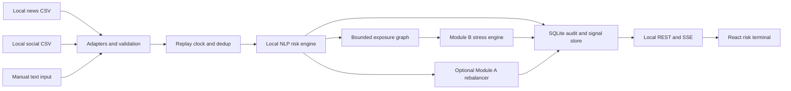

# S&P Sentinel — Product Requirements Document

**Event:** S&P Global & Crisil Campus Hackathon 2026  
**Submission:** Individual; team size 1  
**Document:** Revised specification; requirements, not claims of implemented functionality  
**Product:** Offline financial-text risk intelligence, event replay and portfolio stress analysis  
**Primary delivery:** Unified AI/NLP Risk Engine + Module B  
**Secondary delivery:** Module A, after the primary delivery passes its gates  
**Runtime policy:** No external data APIs, hosted inference, credentials or internet dependency  
**Development policy:** Genuine incremental, feature-wise and bug-fix-wise tested commits; binding workflow in §16. A separate `AGENTS.md` requires user-approved creation.  
**Research:** Open-source options researched using Tinyfish MCP; see `docs/OPEN_SOURCE_RESEARCH.md`  
**Original specification:** Preserved in `docs/PRD.original.md`

---

## 1. Purpose, interpretation and boundaries

### 1.1 Problem
Financial news and social commentary contain early information about credit, operating and macroeconomic risk. Raw sentiment alone is not a portfolio decision: the system must identify the relevant entities, classify events, estimate severity, preserve evidence and demonstrate how a downstream application consumes these signals.

The official problem statement makes the unified AI/NLP engine the primary deliverable. It requires at least two text sources; numerical sentiment; categorical event classification; an impact score; machine-readable output; and at least one downstream module. It does not require both modules, proprietary integrations, large language model training or regulatory certification.

### 1.2 Chosen solution
Build a CPU-first local application that reads pre-downloaded financial news and social-post datasets, emits timestamped records through a replay controller, processes them into auditable risk signals, and triggers a simplified wholesale banking stress test. A second module demonstrates sentiment-driven rebalancing of a mock equity index.

The distinctive engineering is the combination of entity-level evidence, duplicate-aware signals, uncertainty and abstention, bounded contagion, explicit shock assumptions, deterministic replay and reproducible evaluation. It is not a chatbot or a wrapper around one sentiment model.

### 1.3 Offline versus live: mandatory honesty
- The prototype performs **real-time processing of local historical/synthetic replay**, not live market-data collection.
- The UI, README, deck and video must show a persistent `Historical Replay` or `Synthetic Scenario` badge.
- Manual fresh-text input demonstrates immediate processing without claiming that it is a live feed.
- Original publication time, simulated event time, replay time and processing time are distinct fields.
- Fabricated timestamps cannot be used to claim historical trading performance.
- The supplied PS/guidelines permit APIs. Avoiding external APIs is a project decision/user constraint, not a quoted organizer prohibition.
- Replay-only fulfillment of the PS's real-time ingestion objective remains an interpretation risk. Explain this openly; seek organizer confirmation if available, without blocking offline development.
- The backend's own localhost API is allowed by this architecture. It is not an external data service.

### 1.4 Out of scope
Real orders, brokerage connections, paid feeds, client data, live S&P/CRISIL integrations, confidential rating methodologies, HFT claims, distributed microservices, Kubernetes, Kafka, arbitrary LLM-generated financial explanations and guaranteed investment outperformance.

---

## 2. Users and success criteria

### 2.1 Users
1. Evaluator: starts the application, traces an input to an output and challenges assumptions.
2. Risk analyst: compares event severity, exposure and losses across a synthetic portfolio.
3. Developer/candidate: reproduces results, inspects tests and explains the design in Q&A.

### 2.2 Core user journeys
- Select replay → inspect news/social records → inspect a risk signal → see why a stress run did or did not trigger → inspect before/after valuation.
- Enter custom financial text → receive entity-linked structured signals with evidence and uncertainty → inspect downstream effects.
- Pause and step through a scenario → inspect direct and second-order exposure → export the complete audit record.
- Run evaluation → compare models against a baseline → inspect confusion matrices and failures, not only headline scores.
- If Module A ships: inspect signed sentiment → requested weight change → constrained final weight → weight history and cost-aware performance.

### 2.3 Release gates versus targets
Release gates are binary: both text sources work, schema is valid, inference is genuinely local, no duplicate shock application, no look-ahead, financial invariants pass and submission links are accessible.

Quality targets are aspirations, not invented results:
- Sentiment macro-F1 target ≥0.75 on an independently labeled, appropriately scoped holdout; compare against a lexical baseline on the exact same rows.
- Event macro-F1 target ≥0.70 across supported categories, with per-class support and confidence intervals reported where practical.
- Entity linking precision target ≥0.90 on the curated supported universe; unknown entities remain unresolved.
- Severity MAE target ≤1.5 against the documented rubric; disclose subjective label uncertainty.
- End-to-end processing p95 target ≤2 seconds for a short record at 1 record/second, measured after warm-up on the documented CPU configuration.
- Warm start target ≤60 seconds with dependencies and model assets already present; installation and model acquisition measured separately.
- CPU-only application working-set target ≤4 GB; all frontend resources served locally.

Missing a quality target requires measurement, diagnosis and honest reporting. It never permits fabricated labels, cherry-picked samples or claims that it passed.

---

## 3. Scope and priorities

| Priority | Deliverable | Gate |
|---|---|---|
| P0 | Two distinct local text-source adapters | Source identity preserved; news + social records processed |
| P0 | Local NLP: entities, sentiment, event class, impact | Schema + evidence + evaluation |
| P0 | Replay, manual input and audit persistence | Pause/step/reset deterministic; no duplicate actions |
| P0 | Module B simplified multi-asset stress | Event-triggered before/after/loss output; valuation tests |
| P0 | Usable dashboard and exports | Input-to-output path demonstrable offline |
| P0 | Tests, offline package and submission artifacts | Clean-machine run and public-access checks |
| P1 | Bounded supply-chain contagion | Synthetic/sourced edges labeled; cycles and duplicate paths controlled |
| P1 | Module A directional sentiment index | Signed behavior and portfolio constraints verified |
| P2 | FinBERT ONNX/int8 optimization | Measured benefit and quality comparison |
| P2 | MiniLM semantic dedup/event classifier | Holdout improvement or clear operational value |
| P2 | Black-Litterman research mode | Separate from default directional mode; no guaranteed monotonic behavior |
| P2 | Historical VaR/ES and illustrative capital ratio | Adequate factor history and explicit financial assumptions |
| P2 | GLiNER entity extractor experiment | Improves linking without unacceptable resource cost |

Finish P0 before expanding. Module B is the mandatory downstream module because it directly demonstrates event class and impact on the wholesale banking case. Module A is a complete secondary feature, not a half-working promise. If time is limited, ship one complete module; do not put unavailable controls in the submission.

---

## 4. Data acquisition, rights and preparation

### 4.1 Acquisition policy
- Prefer pre-downloaded Kaggle datasets for development; no Kaggle login or token at runtime.
- Manual browser download is acceptable. No hidden acquisition service runs when the app starts.
- Kaggle is a hosting platform, not an underlying source. Two mirrors of the same news corpus do not meet the two-source requirement.
- Preserve the actual origin, uploader, version, license and transformation history.
- Use original publicly licensed data or explicitly labeled authored synthetic records if rights cannot be established.
- No S&P/CRISIL confidential data, client names, engagements or proprietary datasets.
- Downloading a public dataset does not by itself establish redistribution rights.

### 4.2 Candidate datasets, not yet downloaded/approved
| Candidate | Intended role | Cautions |
|---|---|---|
| Kaggle: `ankurzing/sentiment-analysis-for-financial-news` | Financial-news sentiment benchmark | Search result reports CC BY-NC-SA 4.0; verify original license. PhraseBank overlaps FinBERT fine-tuning and is not an independent unseen evaluation. Often lacks entity/timestamp coverage. |
| Kaggle: `thedevastator/tweet-sentiment-s-impact-on-stock-returns` | Social text and possible time/return alignment | Schema, original source, rights, labels and timestamp reliability must be checked before selection. |
| Kaggle: `rdolphin/financial-news-with-ticker-level-sentiment` | Entity-level news candidate | Verify uploader rights and whether labels are machine-generated; do not treat generated labels as unquestionable ground truth. |
| Hugging Face: `zeroshot/twitter-financial-news-sentiment` | Optional alternative if Kaggle source cannot be responsibly bundled | Dataset card states MIT; card/viewer counts differ. Count downloaded rows programmatically. User preference remains Kaggle first. |
| Authored synthetic financial news/social scenarios | License-clean replay and edge-case coverage | Label as authored synthetic, not downloaded real news; distinct source types and production patterns must be documented. |

Dataset choice is a milestone gate. No candidate above is approved simply because it appears in this PRD. Tinyfish fetched Kaggle pages with frontend errors, so its search snippets are discovery evidence, not a completed rights audit.

### 4.3 Required packaged files
- `data/manifest.json`: authoritative metadata and rights for every bundled asset.
- `data/news_demo.csv`: curated redistribution-permitted news records.
- `data/social_demo.csv`: curated redistribution-permitted social records.
- `data/eval/`: frozen evaluation rows, labels, split/group identifiers and annotation guide.
- `data/scenarios/`: baseline/control, credit crisis, supply disruption and rate-shock scenarios.
- `data/wholesale_positions.json`: reproducible synthetic portfolio.
- `data/entity_aliases.csv`: ticker/company/alias universe.
- `data/graph_edges.csv`: sourced or synthetic exposure relationships.
- `data/prices.csv`: only needed for historical Module A evaluation.
- `data/risk_factors.csv`: only needed for historical VaR/ES.

Every file includes a manifest entry with source URL, upstream origin, version, retrieval date when actually retrieved, license/attribution, permission evidence, raw and processed checksums, row count, schema, transformations, synthetic flag, timestamp quality and allowed use.

### 4.4 Preparation and quality checks
1. Validate schema, encoding, empty rows, duplicates, label mapping and timestamp timezone.
2. Normalize text without removing negation, currency, percentages or cashtags.
3. Preserve raw text and stable raw-record IDs.
4. Split by event group and time where genuine timestamps exist; avoid near-duplicates across train/validation/test.
5. Record exclusion reasons; never silently discard difficult holdout cases.
6. Freeze a small reviewed holdout with news and social support for all claimed tasks.
7. Suggested annotation target: 300 distinct texts, with at least 20 supported examples per event class where feasible; use `OTHER` for insufficiently supported categories.
8. Annotate entity spans/links, sentiment, event label, impact, evidence and ambiguity. If there is only one annotator, disclose that and do not invent inter-annotator agreement.
9. Keep synthetic robustness tests separate from independent real-text evaluation.
10. For a historical backtest, use a genuinely overlapping news/price time range; otherwise offer a labeled simulation without alpha claims.

### 4.5 Storage and redistribution
Keep the demo subset small, preferably under 20 MB excluding model assets. Submit all exact data used for the demo/evaluation under `data/`, with appropriate notices. Large exploration corpora not used by the prototype stay outside the submission and are identified as exploration only. Never publish an asset whose license prevents the required public redistribution; replace it or change the use case.

---

## 5. Architecture and open-source stack

### 5.1 Chosen architecture
One Python process owns replay, NLP scheduling, state and quant execution. FastAPI serves a compiled React frontend and localhost HTTP/SSE endpoints. SQLite stores runs, signals, exposures and results. Use a bounded async queue and a CPU worker; do not run blocking inference in the event loop. No Redis, cloud database or external service is required.



### 5.2 Stack decisions
| Component | Default | Rationale |
|---|---|---|
| Runtime | Python 3.11; Node 22 LTS for frontend build | Ordinary toolchains; resolve and lock compatible versions during scaffolding |
| Backend/contracts | FastAPI + Pydantic | Typed schemas, validation and local API |
| Persistence | SQLite + SQLAlchemy; migration script | Small local single-writer system with reproducible state |
| Tabular/math | pandas, NumPy, SciPy | Transparent computations and numerical tests |
| Entities | Exact cashtags + curated aliases + spaCy rules | Auditable precision before optional heavier NER |
| Sentiment | Pinned local ProsusAI/finbert checkpoint | Finance-domain positive/negative/neutral outputs |
| Event model | TF-IDF + scikit-learn logistic regression | Trainable CPU baseline; separate task from sentiment |
| Stronger event model | MiniLM embeddings + logistic regression, conditional promotion | Small local encoder; only promote with measured improvement |
| Severity | Versioned, bounded, evidence-linked rubric | Honest interpretable severity estimate, not an unsupported market forecast |
| Exposure graph | NetworkX | Small deterministic directed graph |
| Module A optimizer | CVXPY; optional PyPortfolioOpt adapter | Explicit constraints; BL only in research mode |
| Frontend | React + TypeScript + Vite + Tailwind + Recharts | Local assets, typed UI and ordinary maintainable components |
| Graph view | Cytoscape.js if P1 graph ships | Interactive relationship visualization without a database |
| Testing | pytest, Hypothesis, Vitest, Playwright | Numerical invariants, API contracts and actual browser behavior |
| Quality | Ruff, mypy where practical, ESLint, lockfiles | Repeatable checks without exotic infrastructure |

### 5.3 Open-source adoption rules
See the research note for evidence and links. Code licenses and model/dataset licenses are separate. Pin model revisions and package versions. Include `THIRD_PARTY_NOTICES.md` and actual license files where required. Reuse libraries with attribution; write the data contract, replay logic, task-specific mapping, shock model, evaluation and user experience for this project. Do not copy a finished hackathon application.

Do not install every researched library. Riskfolio-Lib/skfolio are alternatives to investigate, not extra dependencies layered over CVXPY/PyPortfolioOpt. GLiNER and full QuantLib pricing remain optional experiments. No local GPU training is required.

---

## 6. Domain data contracts

### 6.1 Input record
Required fields:
- `record_id`, `source_id`, `source_type` (`news`, `social`, `manual`).
- `text`, optional original URL and title.
- `published_at` nullable; UTC if genuine.
- `timestamp_quality` (`original`, `date_only`, `synthetic`, `missing`).
- `scenario_id`, `sequence`, `simulated_at` when replaying.
- `is_synthetic`, upstream record ID, optional known entities.

Reject empty or oversized text, invalid timestamps and unsupported formats with a structured validation error. Unknown entities are allowed. Maximum manual text size: 20,000 characters; bounded sentence/chunk processing for long articles.

### 6.2 Risk signal
Emit one signal per resolved entity/event association; also permit a market-level signal for macro events with no single-company target.

```json
{
  "schema_version": "1.0",
  "signal_id": "stable-run-scoped-id",
  "run_id": "run-id",
  "record_id": "source-record-id",
  "source_id": "news_demo",
  "source_type": "news",
  "is_synthetic": true,
  "published_at": null,
  "timestamp_quality": "synthetic",
  "simulated_at": "2023-03-10T09:00:00Z",
  "processed_at": "actual-processing-timestamp",
  "entity": {"name": "Example Bank", "ticker": null, "scope": "company", "resolved": true},
  "sentiment": {"score": -0.8, "label": "negative", "probabilities": {"positive": 0.05, "negative": 0.85, "neutral": 0.10}},
  "event": {"label": "CREDIT", "confidence": 0.82, "abstained": false},
  "impact": {"score": 8, "rubric_version": "1.0", "components": {"event_base": 5, "scope": 2, "explicit_severity": 1}},
  "evidence": [{"start": 0, "end": 12, "text": "source span"}],
  "duplicate_group_id": null,
  "eligible_for_action": true,
  "action_block_reasons": [],
  "model_versions": {"sentiment": "pinned-model-revision", "event": "artifact-checksum", "entities": "aliases-v1"}
}
```

This JSON illustrates the contract only; it is not model output or evidence. Final Pydantic models must validate probability sums, score bounds, labels, source references and actual evidence offsets against raw text.

### 6.3 Provenance and output lineage
Persist the source record, model versions, rubric/config version, dedup decision, entity links, exposure path, shock parameters and downstream result IDs. Every displayed loss links back to a source signal. Exports distinguish direct model output, rules, assumed graph edges and scenario mappings.

---

## 7. Replay and ingestion requirements

### 7.1 Local adapters
Separate news and social adapters map source schemas to the common contract. Manual input uses the same downstream pipeline, not a special hand-coded demo route. Offline import supports CSV/JSON with schema previews and validation counts. No arbitrary URL fetching.

### 7.2 Replay controller
- Start, pause, resume, step, reset and speed selection (`1x`, `5x`, `20x`).
- A logical replay clock controls deterministic ordering and signal decay.
- Tie-break equal timestamps using stable source/record sequence.
- Missing genuine timestamps use clearly synthetic sequence time; these records are excluded from historical backtests.
- Pause stops new admissions; show `draining` until in-flight work finishes.
- Reset creates a new run with clean downstream state; prior runs remain inspectable.
- Replaying twice with identical inputs/config produces identical substantive signals and financial results; processing timestamps and generated run IDs may differ.

### 7.3 Deduplication and event grouping
P0: exact normalized-text hash deduplication. P2: MiniLM semantic near-duplicate grouping, constrained by entity/event context and replay-time window.

Do not repeatedly rebalance or stress the same event because different sources repeat it. Keep every source record for audit; mark duplicate action suppression. Confidence is not boosted merely by many copied headlines. Similarity threshold and grouping rules are selected on validation examples, not tuned on the frozen holdout.

### 7.4 Reliability
Bound the queue, expose pending/in-flight/error counts and prevent replay speed from silently dropping records. Individual record failure is persisted and visible; subsequent records continue. Untrusted news text is data, never instructions to execute code, fetch URLs or change agent behavior.

---

## 8. NLP risk engine

### 8.1 Entity recognition/linking
Resolve cashtags and curated company names/aliases. Preserve text spans and distinguish direct mentions from graph-inferred entities. Ambiguous words such as Apple, Meta and CAT need context. Multiple entities in a sentence receive independent treatment when evidence supports it. Unknown/unresolved companies must not be guessed into the nearest supported ticker.

Optional GLiNER is a candidate mention extractor, not an automatic trusted ticker linker. It must pass the same linking precision tests as the default path.

### 8.2 Sentiment
- Load the tokenizer/checkpoint from a pinned local directory, with network access disabled.
- Use the model's actual label mapping; do not assume array order.
- Numerical score = `P(positive) - P(negative)`, bounded to [-1, 1].
- Preserve all three probabilities and clearly label them uncalibrated unless calibration was actually fitted on validation data.
- Aggregate sentence/chunk evidence consistently; disclose when article-level tone is reused for an entity because entity-specific context is unavailable.
- Handle negation, quoted claims and mixed sentiment; low-confidence text remains inspectable.
- A lexical fallback is an explicitly named degraded mode, not FinBERT in disguise. The release demo must include working local learned-model inference.

### 8.3 Event classification
Supported labels: `GEOPOLITICAL`, `MACRO`, `CREDIT`, `M_AND_A`, `PRODUCT`, `REGULATORY`, `SUPPLY_CHAIN`, `EARNINGS`, `CYBER`, plus `OTHER`.

Train a modest CPU classifier on curated labeled data. Compare TF-IDF/logistic regression to MiniLM-embedding/logistic regression if P2 is attempted. Sentiment labels do not supply event labels. Prototype-similarity classification can be an exploratory baseline but is not described as a fine-tuned multi-head model.

Select confidence/abstention thresholds on validation data. Unsupported or ambiguous events become `OTHER` with an abstention reason. Display top alternatives if available. Gate automatic stress on supported class and adequate confidence; suggested initial threshold 0.60, explicitly configurable and subject to validation.

### 8.4 Impact severity
Default rubric is an illustrative severity estimate, not a calibrated market-loss forecast:
- Event base score 1–6 from a versioned category table.
- Scope increment 0–2: single entity, sector or broad/systemic event, justified by evidence or scenario metadata.
- Explicit severity increment 0–2: evidenced default, closure, material disruption, breach or similarly defined triggers.
- Clamp total to integer [1, 10].

Do not count synonymous severity phrases multiple times. Do not infer insolvency from a negative headline alone. Separate confidence from severity. Store the component breakdown and triggering source spans. Any learned severity regressor is P2 and must outperform this rubric on a labeled independent holdout.

### 8.5 Text tone versus financial exposure
Text sentiment is not necessarily the direction of every asset's response. A rate hike can have different implications for a loan coupon, fixed-rate bond, funding cost and equity. Module B therefore maps event/impact to explicit risk-factor shocks; it does not multiply all portfolio values by sentiment. These mappings are assumptions, shown to the user.

### 8.6 Explanations
Use extracted evidence + a deterministic explanation template: entity match, sentiment probabilities, event label, impact components, action decision and valuation rule. No fabricated quotations, model-internal chain-of-thought claims or unsourced financial facts. Explainability drawer must separate `Observed text`, `Model estimate` and `Scenario assumption`.

---

## 9. Exposure graph and contagion

P1 uses a small directed NetworkX graph. Each edge has source/target, relationship type, transmission coefficient in [0,1], sign, provenance URL or synthetic flag, and a short rationale. Supplier/customer/credit edges are not automatically equivalent.

Propagation uses normalized severity:
`shock_next = clip(shock_current * edge_sign * transmission * (impact / 10) * hop_decay, -1, 1)`.

Requirements:
- Maximum two hops initially; default hop decay 0.5, versioned configuration.
- Cycle guard and per-event visited-path tracking.
- Aggregate multiple paths with a bounded documented rule; do not sum copied exposure indefinitely.
- Direct mentions remain distinct from inferred effects.
- Show source, path, coefficient and assumed sign for each inferred exposure.
- Exposure graph results represent an illustrative scenario channel, not proven causal correlations.
- Do not claim an unsourced relationship percentage such as a particular supplier's 85% share.

Gate tests: no infinite cycles; bounded output; disconnected nodes unaffected; stable replay; two-hop path visible; duplicate news does not multiply exposure.

---

## 10. Module B — mandatory wholesale portfolio stress

### 10.1 Portfolio model
Use a seeded synthetic portfolio with at least three asset types: corporate loans, corporate bonds and interest-rate swaps. CDS is optional after these work.

Each position has ID, synthetic counterparty/entity, sector, currency, valuation date, market value, notional/exposure, asset-specific parameters, risk sensitivities, maturity and assumptions. Use USD as the base currency initially; FX risk is not claimed unless actually modeled.

Display asset values and derivative notionals separately. A `500M` headline must identify whether it means lending/bond exposure, gross notional or total book value. Never add swap notional to bond market value and call it a balance sheet.

### 10.2 Default shock table
Versioned illustrative scenarios, editable in the UI:
- `CREDIT`: spread widening 150 bps at impact 8; loan PD increment 2 percentage points; apply only to linked exposures or explicit sector/systemic scope.
- `MACRO`: yield shift +100 bps at impact 8; sign/direction derived from explicit event metadata or a declared scenario assumption.
- `GEOPOLITICAL`: configured sector spread and yield shifts; no universal assumption that every geopolitical event produces flight-to-quality.
- `SUPPLY_CHAIN`: configured issuer/sector spread widening and documented recovery adjustment.
- Other classes: an explicit mapping or `No automatic stress mapping` state; never fabricate a shock.

Scale base shocks by `impact / 8`, with bounded configurable caps. Display bps versus percentage points versus percentages explicitly. A rate cut and rate hike must not map to the same signed shock.

### 10.3 Trigger policy
Automatically trigger when supported event impact is strictly >7, confidence meets the configured threshold and the event has not already been acted on. The PS threshold is illustrative; this default preserves its example. Manual sandbox stress is separate and labeled user-triggered. Log blocked/ignored events and reasons.

Default stress runs are independent comparisons to the same baseline, not successive accumulation of losses. If cumulative mode is added, give it a separate explicit mode and account for updated state to avoid double-counting.

### 10.4 Valuation rules
**Bonds:** first-order approximation `delta_value = -modified_duration * market_value * (yield_shift + spread_shift)`. Both shifts expressed as decimals; duration in years. Approximation valid only within declared bounds. No double application of a credit haircut and spread effect for the same risk unless explicitly modeled.

**Loans:** illustrative expected credit loss `ECL = EAD * PD * LGD`; incremental stress loss is stressed ECL minus baseline ECL. Clamp PD/LGD to [0,1]. Distinguish ECL approximation from full fair-value pricing and do not count the same credit loss twice.

**Interest-rate swaps:** signed DV01 in currency per 1 bp, defined so `delta_value = signed_DV01 * yield_shift_bps`. Show pay-fixed/receive-fixed direction; receiving fixed should generally lose under a parallel rate increase in this simplified sensitivity model. Notional is metadata, not value.

**Optional CDS:** explicitly distinguish protection bought/sold and signed credit-spread sensitivity. Document maturity, spread and default assumptions; no full CDS pricing claim from a sensitivity approximation.

### 10.5 Required outputs
- Baseline total book value, stressed value, absolute P&L and percentage change where denominator is meaningful.
- Position and asset-class breakdown, with reconciliation to total.
- Credit ECL changes shown separately from derivative/bond mark-to-market estimates.
- Event, impact, exposure scope, shock assumptions and model version.
- Loss waterfall, before/after comparison and asset/sector heatmap.
- Export CSV/JSON and inspectable audit record.

Negative-valued derivative positions are supported; do not clamp all position values to zero. P&L may be positive for hedges. UI must say `Gain` rather than a negative loss where appropriate.

### 10.6 Optional VaR/Expected Shortfall
Use daily factor changes and the same signed position sensitivities to construct portfolio loss samples. Confidence level 99%; horizon 1 trading day initially. Historical VaR = loss quantile; ES = mean tail loss under a documented finite-sample/tie convention. Parametric VaR is optional and labeled normality-based.

Target at least 1,000 aligned factor observations for a 99% estimate; show sample count and tail count. If history is insufficient, display `Unavailable: insufficient risk-factor history`, not a fabricated number. Synthetic factor samples must be labeled simulated. Scenario loss and VaR are distinct metrics. Test tail conventions, units, nonfinite data and zero-risk portfolios.

### 10.7 Optional illustrative capital
Only add after valuation and risk factor support are correct. Use `Total capital ratio = (Tier 1 + Tier 2) / RWA`. Tier 1 ratio is a separate quantity. State 8% total-capital minimum and a 10.5% illustrative total threshold including conservation buffer; jurisdictional and bank-specific requirements may differ.

Starting capital, eligible capital treatment, risk-weight assumptions and stress updates must be explicit. Derivative exposure for RWA is not raw notional. Loss deductions and RWA changes must reconcile. Label `Illustrative capital proxy — not a regulatory compliance assessment`. No claim of official S&P/CRISIL banking standards or Basel certification.

---

## 11. Module A — secondary sentiment index

### 11.1 Universe and baseline
Curate 10–20 supported stocks; initial target 15. Call it a mock index, not an official S&P product. Use dated constituent provenance if claiming S&P 100 membership; no unsupported historical membership assumption. Sector metadata and local prices are versioned.

Default equal weights. Preserve normalized long-only weights summing to 1. Default bounds 0–20% per stock and ≤40% per sector, subject to a feasibility check for the chosen universe. One-way turnover is `0.5 * sum(abs(new_weight - old_weight))`; default cap 10% per step.

### 11.2 Directional default policy
Aggregate direct, duplicate-aware entity sentiment in a replay-time window with decay and confidence eligibility. Positive score requests an increase, negative a decrease, neutral leaves the target unchanged. Project target weights onto feasible constraints using CVXPY.

Store old weight, requested target, actual weight, signed change and binding constraint. Add directional constraints for affected entities where feasible. If conflicting signals/constraints make requested moves impossible, retain safe previous weights and show `Blocked by constraint` or `No feasible directional rebalance`; do not silently reverse the sentiment direction.

Inferred graph signals are separate and disabled by default for the PS's direct-sentiment demonstration. Include cooldown and no-action for duplicate/stale/low-confidence events.

### 11.3 Optional Black-Litterman research mode
Use PyPortfolioOpt for posterior-return calculation with explicitly defined prior, covariance horizon, risk aversion, tau, P/Q/Omega and uncertainty floors. Sentiment-to-return scaling is a heuristic assumption, not calibrated alpha. BL can produce non-monotonic allocation changes through covariance and constraints, so it does not replace the default PS-aligned directional mode.

Compare BL, directional sentiment, equal-weight and no-sentiment constrained strategies using identical data/costs. Report negative results and infeasible optimization. Do not implement multiple competing optimization libraries without a clear need.

### 11.4 Evaluation and visualization
Show weight evolution, signed changes, sector totals, turnover and constraint messages. Return charts require genuine aligned prices and valid timestamps. Decisions use information available by event time; execution occurs at the next available tradable bar. Estimate covariance from a trailing window only. Never use future data for calibration.

Use identical universe, valuation dates, execution schedule and transaction-cost assumptions for comparisons. Default illustrative trading cost: 10 bps per dollar bought/sold, versioned and sensitivity-tested. Annualized metrics use declared 252 trading days and configured risk-free rate; don't hardcode a contemporary 4.5% claim. Benchmark S&P 500 only if suitable legally distributable index data exists; same-universe equal-weight is sufficient.

For timestamp-free datasets or authored crisis replay, show simulated weight behavior only. Hide Sharpe/alpha/performance claims unless the history is actually suitable.

---

## 12. Backend, persistence and security

### 12.1 Proposed localhost endpoints
- `GET /api/health`: build/config/model readiness; never secrets.
- `GET /api/datasets`: manifest summary and source status.
- `POST /api/analyze`: validated manual record through the shared pipeline.
- `GET /api/signals`: paginated filterable audit records.
- `POST /api/replays/start`, `/pause`, `/resume`, `/step`, `/reset`: explicit run IDs.
- `GET /api/runs/{run_id}`: state, source counts, clock, pending work and errors.
- `GET /api/events/stream`: SSE with event IDs, ordering and reconnect support.
- `GET /api/portfolio`, `POST /api/stress`, `GET /api/stress/{id}`.
- `GET /api/graph`: only when graph feature ships.
- `GET /api/weights`: only when Module A ships.
- `GET /api/exports/{run_id}`: validated CSV/JSON export.

Contracts return structured error codes and messages; list endpoints have explicit limits. SSE does not carry arbitrary executable HTML. Use generated OpenAPI as a contract, not undocumented frontend assumptions.

### 12.2 Tables and consistency
Tables: datasets, records, runs, model_artifacts, signals, event_groups, exposure_paths, stress_runs, stress_positions and optional weight_snapshots. Uniqueness on run+record+entity prevents duplicate actions. Store config snapshots with each run. Transactions reconcile parent/child results; deterministic migrations and a safe reset command must exist.

### 12.3 Local threat model
Bind to localhost by default. Restrict browser origins and check origin for state-changing browser requests. No secrets required. Uploaded/imported files have limits, fixed parsing rules and path traversal protection. Never execute CSV content, pickle from arbitrary imports, or remote model code. Use safe artifact formats and `trust_remote_code=False` where supported. Escape text in the UI; protect CSV exports against formula injection. No telemetry or external fonts/CDNs in offline runtime.

---

## 13. UX specification

### 13.1 Layout
A restrained dark risk terminal, not a decorative glassmorphic dashboard. Header: replay mode, clock, model status, run controls. Main workspace: source feed and signal inspector; stress overview and position drill-down. Optional tabs: exposure graph, index weights, evaluation.

Do not cram both modules into unreadably small columns. Ship readable desktop tables and responsive stacking at 390 px. Use text contrast ≥4.5:1, keyboard-accessible controls and color-independent severity labels.

### 13.2 Required surfaces
- Source feed: news/social badges, raw excerpt, timestamps, synthetic marker, duplicates and processing state.
- Signal inspector: entity, probabilities, event/impact, evidence highlights, eligibility and explanation.
- Portfolio: baseline, stressed value, gain/loss, asset-class waterfall, position table and assumptions.
- Replay controls: run selection, play/pause/step/speed/reset; progress and queue status.
- Manual input: examples clearly labeled authored examples; loading, validation and error states.
- Evaluation: model versus baseline, class supports, confusion matrix, latency, failure examples and data limitations.
- Exports: source-linked JSON/CSV with visible completion/error states.

### 13.3 State behavior
No data means an honest empty state. Insufficient price/factor history means unavailable metrics. Missing learned-model assets shows an explicit startup error or opt-in degraded mode badge. Pending actions disable duplicate submissions. SSE disconnection shows reconnecting status; it does not display fabricated fresh signals. Audio is optional and off by default.

---

## 14. Evaluation and test strategy

### 14.1 NLP benchmark
Freeze dataset/splits/config and record checksums before evaluation. Report sentiment and event macro-F1, per-class precision/recall/support, confusion matrices, entity-link precision/recall, severity MAE and abstention coverage/error. Include baseline comparisons and representative mistakes. PhraseBank performance is labeled in-domain/possibly contaminated for FinBERT, not independent generalization.

### 14.2 Adversarial and robustness cases
- Negated bankruptcy, acquisition rumors, quoted allegations and mixed entities.
- Ambiguous ticker/common words, unknown entities, unsupported language and long text.
- Repeated headline across both sources and near-duplicate syndication.
- Severe event with neutral linguistic tone and strongly negative opinion with low material impact.
- Rate increase versus cut; CDS protection direction; fixed versus floating exposure.
- Input text containing prompt-like instructions, HTML and spreadsheet formulas.
- Missing timestamps, reversed record order and replay reset while work is in flight.

### 14.3 Financial invariants
- Position P&L sums to total; before+P&L equals after.
- Bps conversion and percentages tested explicitly.
- PD/LGD bounded; incremental ECL calculated against baseline.
- Swap sign convention and derivative negative market values handled.
- Zero shock yields zero change; unrelated entity exposure stays unchanged.
- Duplicate events do not create additional stress runs.
- Graph outputs bounded; cycles terminate; independent reruns reset to baseline.
- Weight sum/bounds/sector/turnover hold; sign requests honored or explicitly blocked.
- No-look-ahead test fails if future prices/covariance enter a decision.
- Statistical risk outputs have documented horizon/sample/tail counts.

### 14.4 Runtime tests
Run API tests, model-adapter tests, numerical/property tests, frontend unit tests and Playwright flows. CI fast tests may use explicit stubs for unit isolation, but the release gate must run real local inference. Never claim stub results prove model quality or production inference.

A packaged offline integration test denies external network while allowing localhost communication and confirms ingestion → local inference → stress → dashboard → export. Perform a separate cold-install test with its true network requirements disclosed.

### 14.5 Ablations
When implemented, compare no dedup versus dedup, direct exposure versus graph exposure, lexical versus FinBERT sentiment and TF-IDF versus MiniLM event models. Quantify false repeated actions, task quality, runtime and memory. Do not call a feature innovative purely because a library is present.

---

## 15. Reproducible packaging

### 15.1 Two explicit distribution paths
**Source build:** Docker Compose builds dependencies/frontend and may require internet during installation. Document `docker compose up --build`, tested OS/tool versions and actual build time.

**Offline runtime:** provide a prebuilt image archive or equivalent release bundle with model assets and notices already included, plus checksums and load/run instructions. This path requires Docker installed but no external runtime services. Large binaries stay in release assets or explicitly accessible approved artifact storage, not ordinary git history. Do not depend on Git LFS downloads during offline evaluation.

Local model loading uses `local_files_only=True` where available and offline environment flags. Missing artifacts must fail clearly; startup must never auto-download a checkpoint. All models have pinned revisions/checksums and reviewed redistribution terms. If model licensing cannot be established, choose a permitted alternative rather than silently bundle it.

### 15.2 Required developer commands
Implement and document real commands, preferably through a cross-platform task script:
- bootstrap dependency installation; data validation; model preparation/export.
- backend/frontend development; build; unit tests; integration tests; browser tests.
- evaluation; replay; export; offline verification; secret/data-license checks.

These are requirements, not currently existing commands. README must show the exact commands actually tested, not illustrative `python main.py` if that entry point does not exist.

### 15.3 Repository layout
```text
<college>-<candidate-name>-hackathon/
├── README.md
├── AGENTS.md
├── PRD.md
├── LICENSE
├── THIRD_PARTY_NOTICES.md
├── pyproject.toml
├── uv.lock
├── src/sentinel/
│   ├── api/
│   ├── contracts/
│   ├── ingestion/
│   ├── replay/
│   ├── nlp/
│   ├── graph/
│   ├── stress/
│   ├── allocation/
│   └── storage/
├── frontend/
├── tests/
├── scripts/
├── data/
├── docs/
│   ├── OPEN_SOURCE_RESEARCH.md
│   ├── architecture.png
│   ├── presentation.pdf
│   ├── evaluation.md
│   ├── assumptions.md
│   └── verification.md
└── .github/workflows/ci.yml
```

The current folder is not a git repository. Initialize one during the implementation milestone, not merely to manufacture a document history. Exclude secrets, environments, generated runtime databases, raw unused corpora, browser artifacts and large model binaries. Maintain portable relative paths, not developer-machine paths.

---

## 16. Agent development and commit contract

### 16.1 Genuine incremental development
Commit each independently meaningful implemented feature, bug fix, test addition, refactor or documentation/configuration change as it is completed and verified. The history should show the actual engineering progression, not one giant final dump and not artificial edits designed to impersonate a manual author.

No fabricated bugs, fake regressions, backdated timestamps, forged authorship, empty commits, splitting already finished code retroactively to invent a process, or hiding permitted AI assistance if asked. All work must be explainable by the candidate and consistent with the guidelines' honesty requirement.

### 16.2 Required per-change loop
1. Inspect the relevant code, git status and existing tests.
2. Choose a narrow acceptance criterion and document it locally.
3. For behavior/bug changes, add a meaningful test; demonstrate failure when appropriate.
4. Implement the smallest complete change.
5. Run focused tests and applicable lint/type/build checks synchronously.
6. Review the diff for unrelated work, numerical correctness, security and licenses.
7. Stage exact relevant files, not a blind `git add .`.
8. Commit using a descriptive message; include verification and limitations in the body when useful.
9. Confirm the resulting commit and clean/scoped status before the next feature.

Do not leave a feature uncommitted while implementing several unrelated features. Do not create a commit for every keystroke or every file if they form one coherent feature. Small coherent steps are the unit of history.

### 16.3 Commit types and examples
- `chore: initialize backend tooling and lock dependencies`
- `feat(data): validate local news and social records`
- `test(nlp): cover negation and ambiguous company aliases`
- `feat(nlp): add local financial sentiment inference`
- `feat(stress): value bonds under parallel spread shocks`
- `fix(stress): convert basis points before duration valuation` — only if that bug genuinely occurred.
- `feat(ui): show source evidence beside stress results`
- `refactor(replay): isolate run clock from wall time`
- `docs: document replay assumptions and dataset licenses`

Messages describe actual changes. Do not prescribe a fake fix list or target number of commits. A regression test and its fix normally belong together in one verified fix commit. Feature tests may be separate commits if that genuinely reflects a useful development step; do not keep main knowingly broken just for narrative.

### 16.4 Push policy
Initialize local git when implementation starts. Make local commits throughout. Once an approved remote exists, push each completed green feature/milestone batch promptly and verify the remote branch head. Never publish unchecked datasets/secrets, force-push or rewrite history without explicit authorization. No GitHub repository creation or push is authorized by this PRD-writing task alone.

### 16.5 Failure behavior
On a real test/build failure, diagnose, fix and rerun. If a previously committed feature has a defect, record its regression and a separate truthful fix commit. If a blocker cannot be resolved, commit only independently verified work and document the blocker; never relabel a failing feature done. Preserve unrelated dirty user work and never restart/kill their apps without permission.

---

## 17. Implementation milestones and gates

| Milestone | Work | Mandatory evidence before moving on |
|---|---|---|
| M0 | Repo/toolchain/plan and exact source selection | Scope confirmed, initial tooling checks, source/license audit, no unresolved redistribution issues |
| M1 | Typed records, manifests, adapters and baseline data | Two source types loaded; validation, hashes/counts and adapter tests |
| M2 | Replay clock, persistence and exact dedup | Deterministic pause/step/reset; duplicate suppression; persisted lineage |
| M3 | Entities, local FinBERT, event classifier and severity | Real offline inference; independent evaluation; fallback/abstention/evidence tests |
| M4 | Synthetic loans/bonds/swaps and stress mapping | Reconciliation, direction/unit tests and event-triggered before/after results |
| M5 | API/SSE, manual input and core dashboard | Browser end-to-end flow, loading/error/empty states, exports |
| M6 | Offline package and P0 evaluation | Offline integration, clean startup, measured latency/memory and actual evaluation report |
| M7 | Exposure graph if time permits | Two-hop visual trace; bounded/cycle/dedup tests; assumptions clearly shown |
| M8 | Module A if time permits | Directional behavior, weight constraints and timestamp-valid performance or honest simulation |
| M9 | Optional stronger models/quant extensions | Benchmark/ablation evidence; never at the expense of core completion |
| M10 | Submission deck/video/README and release | Public-access checks, 5-minute demo rehearsal and tagged final version |

Within each milestone, commit independently meaningful features and genuine fixes as they pass their checks. Milestones are not permission to hold all changes for one giant milestone commit.

---

## 18. Submission compliance and communication

### 18.1 Checklist
- Individual candidate; team size 1.
- Public repository, naming convention `<college>-<candidate-name>-hackathon`.
- Root README using the provided mandatory structure and candidate name, college email, campus, video and deck links.
- README sections: overview/approach; architecture/stack; dataset sources/assumptions; exact quickstart and tested runtime/OS; key results/domain impact.
- A license is mandatory; use MIT for original project code, while respecting separate dependency/model/data terms. MIT is recommended by the guidelines, not the only allowed license.
- Architecture source and high-resolution rendered diagram.
- Exact CSV/JSON data used by prototype/evaluation, source notices and synthetic disclosures.
- Five to seven slides as PDF/PPTX; repo-hosted PDF linked from README is preferred.
- Ten-minute screen recording on unlisted YouTube, linked from README and verified in an incognito window.
- Separate live working demonstration not exceeding five minutes, plus readiness for Q&A.
- No restricted/broken slide or video links; do not use Google Drive/OneDrive for slides per the supplied checklist.
- Incremental actual build commits; repository free of unnecessary large dumps.
- Final source/video/deck submitted through the official form before the communicated deadline. Do not invent a deadline.
- Attend the scheduled jury pitch or communicate a valid issue in advance.

### 18.2 Seven-slide outline
1. Title/candidate/campus and honest offline-replay positioning.
2. Problem, PS requirements and prioritized approach.
3. Data provenance, local architecture and signal contract.
4. NLP/evidence/uncertainty with measured baseline comparison and failure example.
5. Event-driven stress: before/after values, position breakdown and financial assumptions.
6. Engineering differentiator: dedup/contagion or index module with actual ablation/results.
7. Domain value, limitations, feasibility and next steps; integrations are future potential only.

### 18.3 Ten-minute recorded demo
- 0:00–1:00: problem, offline/replay boundaries and architecture.
- 1:00–2:00: actual startup from README and packaged assets.
- 2:00–4:00: both sources, signals, evidence, duplicate suppression and uncertainty.
- 4:00–6:30: event-triggered stress, baseline/post values and assumptions.
- 6:30–8:00: manual text and graph/index feature only if implemented.
- 8:00–9:00: evaluation, baseline comparison and failure/limitation example.
- 9:00–10:00: exports, reproducibility, domain impact and conclusion.

### 18.4 Separate five-minute live demo
- 0:00–0:30: problem and local replay disclosure.
- 0:30–1:30: replay records from both sources and inspect one signal.
- 1:30–3:00: automatically triggered stress, source-to-loss trace and valuation explanation.
- 3:00–4:00: manual input or graph/index differentiator.
- 4:00–5:00: measured evaluation, export and limitations.

Have an already running local instance and a local backup recording. A recording supports recovery but is not claimed to replace a required live demo. Domain understanding is the first stated tie-breaker, not a published numerical scoring weight.

---

## 19. Risks and mitigation

| Risk | Mitigation |
|---|---|
| Replay differs from live external ingestion expectation | Persistent disclosure, manual streaming input, organizer confirmation if available |
| Kaggle rights or original provenance unclear | Gate selection; permitted substitute or clearly synthetic data; no unauthorized public dump |
| FinBERT benchmark overlap | Independent reviewed holdout and contamination note |
| Dataset lacks original event times/entities | Use it for classification only; no fabricated backtest |
| Event classifier has weak rare-class coverage | OTHER/abstention, class support reporting, reduce unsupported claims |
| Rules masquerade as predictive severity | Rubric/evidence display; report estimate and label uncertainty |
| Graph relationships guessed | Synthetic edge labels, bounded propagation and no causal claims |
| Over-scoped quant work | P0 Module B first; optional extensions only after core gates |
| Offline artifact licensing or size | Separate code/model licenses, release bundle, checksums and actual offline test |
| Different derivative units corrupt totals | Explicit market value/notional/sensitivity units and reconciliation tests |
| Slow inference blocks UI | CPU worker, bounded queue, measured throughput and local optimization |
| Agent creates a giant or deceptive commit history | Enforce §16 per-change loop and audit real commits |

---

## 20. Definition of done

The submission is done only when:
1. Both source adapters process real bundled records with correct provenance.
2. A locally executed learned sentiment model, event classifier and documented severity rubric emit valid evidence-linked signals.
3. Module B consumes those signals and produces reconciled before/after valuation across loans, bonds and derivatives.
4. Replay/manual workflows are deterministic, deduplicated and visible in the real browser.
5. Evaluation reports actual results, supports, assumptions, failures and model/data versions.
6. The distributed runtime is exercised with external networking denied and localhost allowed.
7. Every shipped feature passes focused tests; financial units/signs and data/secret safety checks pass.
8. Optional graph/index/BL/VaR/capital features either pass their own gates or are removed/clearly marked not included.
9. Repository history records genuine incremental development, with feature/fix commits and no fabricated authorship/timestamps.
10. README, licenses, bundled data, diagram, deck and video are complete and public-access tested; the five-minute demo is rehearsed.

A detailed PRD is not evidence that this application already exists. Until implementation and verification are performed, all product behavior and numerical targets in this document remain requirements.
