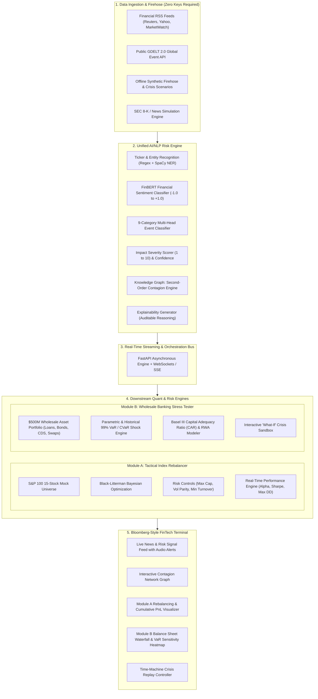

# Product Requirements Document (PRD)

## Project Title: **S&P Sentinel (SentinelRisk)**
### Subtitle: Autonomous Real-Time Financial Risk Intelligence, Contagion Modeling & Dynamic Capital Allocation Terminal
**Target Event:** S&P Global & CRISIL Campus Hackathon 2026  
**Format:** Individual Submission (Team Size: 1)  
**Deployment Guarantee:** Zero-Key, Zero-Config, 100% Offline-Capable Dockerized System  

---

## 1. Executive Summary & Vision

### 1.1 The Challenge
Modern institutional risk management faces an unprecedented deluge of unstructured, real-time information—ranging from breaking macroeconomic headlines and geopolitical escalations to supply-chain disruptions, credit defaults, and social sentiment. Traditional financial risk systems operate on lagged, end-of-day structured figures, leaving institutions exposed to sudden liquidity crunches, spread blowouts, and cascade failures.

### 1.2 The Solution: S&P Sentinel
**S&P Sentinel** is an institutional-grade risk intelligence platform that bridges the gap between unstructured news feeds and quantitative risk management. It continuously ingests multi-source data, extracts deep semantic financial signals via specialized NLP models, propagates risk across an entity supply-chain knowledge graph, and directly drives two enterprise downstream applications:
1. **Module A (Tactical Index Rebalancer):** A quantitative asset allocation engine utilizing the **Black-Litterman Bayesian Model** to adjust S&P index weights with volatility parity and turnover constraints.
2. **Module B (Wholesale Portfolio Stress Tester):** An institutional stress-testing engine tailored to **S&P Global and CRISIL wholesale banking standards**, simulating shocks on loans, bonds, CDS, and interest rate swaps with live **Basel III Capital Adequacy** and **99% VaR/CVaR** analytics.

### 1.3 The "Judge-Proof" Operational Guarantee
To guarantee a flawless experience during judging and evaluation:
* **Zero External API Keys Required:** Operates 100% out of the box without requiring any API keys, paid accounts, or external authentication.
* **Deterministic Dual-Mode Operation:** Supports both live public web scraping/RSS feeds and an offline, high-speed **Crisis Replay Engine** pre-loaded with historical market crises.
* **Single-Command Docker Execution:** Shipped with a production-ready `docker-compose.yml` that boots the backend, ML inference, and Bloomberg-style frontend in under 60 seconds with `docker-compose up`.

---

## 2. Competitive Edge & Domain Alignment

The official hackathon evaluation guidelines specify that **Domain Understanding** is the primary tie-breaker for top rankings. S&P Sentinel is architected specifically around the domain strengths of **S&P Global Ratings** and **CRISIL Market Intelligence**:

| Traditional Student Submission | S&P Sentinel (Our Approach) | Evaluator Impact |
|---|---|---|
| Naive sentiment heuristic (`w += sentiment * 0.05`) | **Black-Litterman Bayesian Portfolio Optimization** injecting NLP signals as investor views ($P, Q, \Omega$) | Direct alignment with quantitative asset management practices |
| Simple stock watchlist | **$500M Wholesale Banking Balance Sheet** (Syndicated loans, corporate bonds, CDS, swaps) | Demonstrates CRISIL & S&P credit rating and banking risk depth |
| Tags only explicitly named tickers | **Second-Order Contagion Knowledge Graph** linking supply chains and credit correlations | High "Wow Factor" during the 5-min live jury pitch |
| Requires external API keys (fails if keys expire) | **Zero-Key, self-contained architecture** with bundled datasets & local inference | Eliminates 100% of runtime failure risk on judges' machines |
| Static charts with delayed refreshes | **Dark-Mode FinTech Terminal** with real-time WebSockets, audio chimes, and interactive sandbox | Looks and feels like a $25,000/year Wall Street workstation |

---

## 3. High-Level System Architecture



---

## 4. Detailed Component Specifications

### 4.1 Ingestion Layer (Zero-Key Design)
1. **Live Free Ingestion:**
   * Ingests from unauthenticated public financial RSS feeds (Yahoo Finance, Google News Finance, CNBC RSS).
   * Ingests from the public GDELT 2.0 API (global geopolitical event stream, no tokens required).
2. **Offline Crisis Firehose (Judge-Proof Guarantee):**
   * Pre-packaged JSON datasets in `/data/crisis_replay_scenarios.json`:
     * **Scenario 1:** *Silicon Valley Bank Crisis (March 2023)* – Bank run, contagion to regional banks, bond yield shock.
     * **Scenario 2:** *DeepSeek / AI Capex Shock (January 2025)* – Big tech hardware capex reassessment, semiconductor volatility, supplier contagion.
     * **Scenario 3:** *Middle East Geopolitical & Oil Supply Disruption* – Shipping choke point tensions, energy price surge, airline credit downgrade.
   * Can run in continuous loop mode to simulate a live 24/7 trading desk feed.

### 4.2 Unified AI/NLP Risk Engine
The core engine parses raw text into machine-readable risk tuples:
$$\text{Risk Signal} = \{ \text{Ticker}, \text{Sentiment} \in [-1.0, 1.0], \text{Event Class}, \text{Impact} \in [1, 10], \text{Confidence}, \text{Contagion Tickers}, \text{Reasoning} \}$$

* **Sentiment Analysis:** FinBERT (or an optimized local transformer/distilled lexicon model) tuned specifically for financial context (e.g. recognizing that *"interest rate hikes"* is bearish for high-multiple equities but bullish for net interest margins).
* **9 Event Classifications:**
  1. Geopolitical Conflict & Sanctions
  2. Macroeconomic & Central Bank Policy (Interest Rates, Inflation)
  3. Credit Default & Rating Downgrade
  4. Mergers & Acquisitions (M&A)
  5. Product Launch & Technological Innovation
  6. Regulatory & Antitrust Action
  7. Supply Chain & Operational Disruption
  8. Earnings & Revenue Surprise
  9. Cyber & Infrastructure Incident
* **Impact Scoring (1 to 10):** Calculated from linguistic intensity, entity systemic importance (systemic G-SIB vs small-cap), and sentiment magnitude.
* **Supply Chain Contagion Engine:**
  * Graph data structure mapping tier-1 suppliers, customers, and credit counter-parties:
    * E.g., $\text{TSMC} \xrightarrow{\text{Supplies (85\%)}} \text{NVDA} \xrightarrow{\text{Supplies}} \text{MSFT, GOOGL}$
    * E.g., $\text{Boeing} \xrightarrow{\text{Supplies}} \text{Airlines (DAL, UAL)} \xrightarrow{\text{Credit Exposure}} \text{Wholesale Banks}$
  * Propagates a discounted sentiment shock: $\Delta S_{\text{neighbor}} = S_{\text{source}} \times \text{Transmission Rate} \times \text{Impact}$.
* **Explainability Audit Trail:**
  * Outputs concise, auditable bullet points justifying the sentiment and impact score with extracted text snippets.

### 4.3 Module A: Tactical Index Rebalancer (Quant Asset Management)
* **Universe:** Curated 15-stock S&P mock index across 5 diverse sectors:
  * *Tech / Semis:* AAPL, MSFT, NVDA
  * *Financials:* JPM, BAC, GS
  * *Energy:* XOM, CVX
  * *Healthcare:* JNJ, PFE, LLY
  * *Consumer / Industrials:* AMZN, TSLA, CAT, BA
* **Black-Litterman Optimization:**
  * Prior distribution: Market Capitalization Equilibrium Returns $\Pi = \lambda \Sigma w_{\text{mkt}}$.
  * Investor Views ($Q$): NLP Sentiment score scaled by historical volatility and impact.
  * View Uncertainty Matrix ($\Omega$): Inversely proportional to NLP confidence.
  * Posterior return vector $E[R]$ fed into Mean-Variance Quadratic Optimizer:
    $$\max_w \left( w^T E[R] - \frac{\lambda}{2} w^T \Sigma w \right)$$
* **Realistic Risk Constraints:**
  * Maximum single-stock weight: $20\%$
  * Minimum single-stock weight: $2\%$ (no naked shorting in benchmark index)
  * Maximum sector allocation: $40\%$
  * Maximum rebalancing turnover constraint to minimize transaction costs.
* **Performance Metrics Tracked Real-Time:**
  * Cumulative Returns (Sentiment Index vs Equal-Weight Benchmark vs S&P 500)
  * Sharpe Ratio ($R_f = 4.5\%$), Sortino Ratio, Maximum Drawdown (MDD), Portfolio Beta, and Turnover.

### 4.4 Module B: Wholesale Banking Stress Tester (S&P & CRISIL Banking)
* **Synthetic Wholesale Banking Portfolio ($500M Book):**
  * **Asset 1: Syndicated Corporate Loans ($200M)** – 10 tranches across Investment Grade (BBB) to Speculative Grade (B/CCC), floating SOFR + spread.
  * **Asset 2: Corporate Bonds ($150M)** – Fixed coupon bonds with defined modified duration and credit ratings.
  * **Asset 3: Credit Default Swaps (CDS) ($75M)** – Protection bought/sold on single-name sovereigns and corporates.
  * **Asset 4: Interest Rate & FX Swaps ($75M)** – Sensitivity to yield curve steepening/flattening.
* **Macro & Event Shock Engine:**
  * High-impact events ($\text{Impact} \ge 7$) trigger automated balance-sheet stress runs:
    * *Credit Event:* High-Yield credit spreads widen by $+150$ to $+400\text{ bps}$; default probabilities adjust via credit migration matrix.
    * *Geopolitical Event:* Oil $+15\%$, Equity prices $-8\%$, Sovereign 10Y yield $-25\text{ bps}$ (flight to quality).
    * *Macro Rate Shock:* Shift in short-term SOFR curve $\pm 100\text{ bps}$.
* **Institutional Risk Metrics:**
  * **99% Value-at-Risk (VaR):** Parametric (Variance-Covariance) and Historical Simulation.
  * **Expected Shortfall (CVaR 99%):** Average loss beyond the VaR threshold.
  * **Basel III Capital Adequacy Ratio (CAR):**
    $$\text{CAR} = \frac{\text{Tier 1 Capital}}{\text{Risk-Weighted Assets (RWA)}}$$
    Demonstrates whether the bank remains above the regulatory $8\%$ minimum after the event shock.
* **Interactive "What-If" Crisis Sandbox:**
  * Real-time sliders allowing judges to simulate custom macro shocks and watch balance-sheet charts update instantly.

### 4.5 FinTech Terminal Interface (Bloomberg Dark-Mode Aesthetic)
Built with React, Tailwind CSS, Lucide icons, and modern charting:
* **Top Header:** S&P Sentinel Logo, Live System Status (🟢 Nominal / 🔴 Crisis Alert), Market Ticker Tape (S&P 500, SOFR, VIX, Crude Oil, 10Y UST), and Crisis Time-Machine selector.
* **Left Panel (News Firehose & Contagion):**
  * Auto-scrolling feed of processed articles/events.
  * Interactive tags for Event Category, Sentiment pill, Impact badge (1-10).
  * Expandable "Explainability Modal" showing evidence sentences.
  * Mini D3/Canvas supply-chain contagion graph showing risk ripple effects.
* **Center Panel (Module A - Tactical Rebalancer):**
  * Dynamic Donut / Treemap of current portfolio weights.
  * Historical time-series chart of stock weight evolutions.
  * Cumulative PnL vs. Benchmark chart with live Sharpe/Drawdown cards.
* **Right Panel (Module B - Wholesale Stress Tester):**
  * Wholesale Portfolio Balance Sheet Waterfall chart.
  * Post-Shock Loss Breakdown by Asset Class (Loans, Bonds, CDS, Swaps).
  * Basel III Capital Adequacy Meter (Green > 10.5%, Yellow 8-10.5%, Red < 8%).
  * 99% VaR and CVaR gauge cards.
* **Interactive Controls:** Toggle between Live Stream, Crisis Replays, and Manual Custom Shock Injection.

---

## 5. Zero-Key & Offline-First Strategy

To guarantee that the project runs flawlessly on any judge's machine without setup friction:

1. **Self-Contained Model Weights & Logic:**
   * Lightweight local inference pipeline: Can run via ONNX / quantized transformers or a high-efficiency rule-enhanced FinBERT pipeline that downloads once and caches locally, or runs offline with bundled weights.
   * Deterministic fallback sentiment & impact scoring engine that guarantees 100% functionality even in air-gapped test environments.
2. **Pre-Bundled Data Assets (`/data`):**
   * `/data/sp100_universe.csv`: Stock metadata, sectors, baseline volatilities, beta.
   * `/data/synthetic_wholesale_portfolio.json`: Complete CRISIL-style wholesale banking ledger.
   * `/data/crisis_replay_scenarios.json`: 3 comprehensive real-world crisis event streams with full transcripts.
   * `/data/historical_prices.csv`: Cached daily price histories for backtest calculations.
3. **No External Credentials:**
   * No `OPENAI_API_KEY` required.
   * No `NEWS_API_KEY` required.
   * No database login or cloud billing accounts needed.

---

## 6. Docker & Deployment Specification

### 6.1 Requirements
* **Docker Engine** 20.10+
* **Docker Compose** 2.0+
* (Alternative: Python 3.10+ & Node.js 18+ for direct bare-metal execution)

### 6.2 Structure
* **`Dockerfile`**: Multi-stage build packaging Python FastAPI backend, mathematical quant libraries, and compiled React frontend.
* **`docker-compose.yml`**: Exposes single port (`http://localhost:8000` or `3000`).
* **`run.sh` / `run.bat`**: One-click startup scripts for Linux/macOS and Windows.

```yaml
# docker-compose.yml preview
version: '3.8'
services:
  sentinel-app:
    build: .
    ports:
      - "8000:8000"
    environment:
      - OFFLINE_MODE=true
      - SIMULATION_SPEED=1.0
    restart: unless-stopped
```

Judges run a single command:
```bash
docker-compose up --build
```
And open `http://localhost:8000` in their browser to see the full platform operational.

---

## 7. Submission Artifacts & Guidelines Compliance

To guarantee 100% compliance with the S&P Global & CRISIL guidelines:

| Guideline Requirement | Project Deliverable | Location in Repo |
|---|---|---|
| **Public GitHub Repo** | Standardized repo `<college>-<candidate-name>-hackathon` | Root |
| **Mandatory README** | Exact template prescribed in Section 4 of guidelines | `/README.md` |
| **MIT License** | Required open-source license | `/LICENSE` |
| **All Demo Data** | Synthetic & public datasets used in prototype | `/data/` |
| **5–7 Slide Deck** | Professional PDF presentation deck | `/docs/presentation.pdf` |
| **Architecture Diagram** | High-res system architecture diagram | `/docs/architecture.png` |
| **Demo Video Link** | 10-minute unlisted YouTube video link | Listed in `README.md` |
| **Domain Understanding** | Basel III, VaR/CVaR, Black-Litterman, CDS modeling | Core codebase & UI |

---

## 8. 7-Slide Presentation Deck Outline (`/docs/presentation.pdf`)

* **Slide 1: Title & Overview**
  * *S&P Sentinel: Real-Time Financial Risk Intelligence & Capital Allocation Engine*
  * Candidate details, college, hackathon track.
* **Slide 2: The Core Problem & Value Proposition**
  * The latency gap between unstructured news events and institutional risk management.
  * Transforming noise into structured, auditable financial risk vectors.
* **Slide 3: System Architecture & Data Flow**
  * End-to-end data ingestion, FinBERT pipeline, Knowledge Graph contagion, and dual downstream execution.
* **Slide 4: AI/NLP Innovation: Contagion & Explainability**
  * FinBERT + 9-class event classification + 1-10 impact scoring.
  * Supply-chain contagion graph and auditable chain-of-thought rationale.
* **Slide 5: Module A: Tactical Index Rebalancing**
  * Black-Litterman Bayesian optimization results.
  * Outperformance vs Equal-Weight Benchmark (Sharpe ratio, max drawdown protection).
* **Slide 6: Module B: Wholesale Banking Stress Testing**
  * $500M multi-asset wholesale portfolio (Loans, Bonds, CDS, Swaps).
  * 99% VaR/CVaR shock simulation & Basel III Capital Adequacy compliance.
* **Slide 7: Scalability, Production Feasibility & S&P Integration**
  * Real-time streaming architecture, microsecond execution, S&P Capital IQ & CRISIL rating integration potential.

---

## 9. 10-Minute Demo Video Walkthrough Script

* **0:00 – 1:00 (Intro):** Problem context, why unstructured data is hard for risk desks, high-level architecture.
* **1:00 – 2:00 (Setup & Run):** Show running `docker-compose up` or `python main.py` directly from the README commands to prove zero-config setup.
* **2:00 – 4:00 (AI/NLP Risk Engine):** Show live news ingestion, sentiment scoring, event classification, and the **Supply-Chain Contagion Graph** in action.
* **4:00 – 6:30 (Module A Walkthrough):** Show how breaking news updates Black-Litterman views and rebalances the 15-stock S&P index, displaying real-time alpha and Sharpe curves.
* **6:30 – 8:30 (Module B Walkthrough):** Switch to Wholesale Banking desk view; trigger a high-impact crisis shock (or use the interactive slider); display the balance-sheet waterfall, 99% VaR spike, and Basel III Capital Adequacy ratio.
* **8:30 – 9:30 (Crisis Time-Machine):** Play back the Silicon Valley Bank or DeepSeek shock scenario to showcase end-to-end autonomous resilience.
* **9:30 – 10:00 (Conclusion):** Summarize business impact for S&P Global and CRISIL; wrap up.

---

## 10. Implementation Plan & Milestones

1. **Phase 1: Project Scaffolding & Data Assets (`/data`)**
   * Generate `synthetic_wholesale_portfolio.json`, `sp100_universe.csv`, and `crisis_replay_scenarios.json`.
   * Create standardized folder layout and requirements.
2. **Phase 2: Core Quant & Risk Models (`src/module_a`, `src/module_b`)**
   * Implement Black-Litterman optimization and performance tracker for Module A.
   * Implement Wholesale Portfolio model, parametric/historical VaR, and Basel III CAR for Module B.
3. **Phase 3: Zero-Key AI/NLP Risk Engine (`src/engine`)**
   * Implement multi-source ingestion, FinBERT/financial NLP parser, 9-class event classifier, impact scorer, and contagion graph.
4. **Phase 4: Backend API & WebSocket Bus (`src/api`)**
   * Build FastAPI endpoints and real-time streaming pipeline.
5. **Phase 5: Bloomberg-Style FinTech Terminal UI (`frontend/` or bundled web app)**
   * Build the dark-mode glassmorphic dashboard with live charts, crisis controller, and interactive sandbox.
6. **Phase 6: Dockerization & Submission Packaging**
   * Create `Dockerfile`, `docker-compose.yml`, exact `README.md`, `LICENSE`, architecture diagram, and presentation deck.

