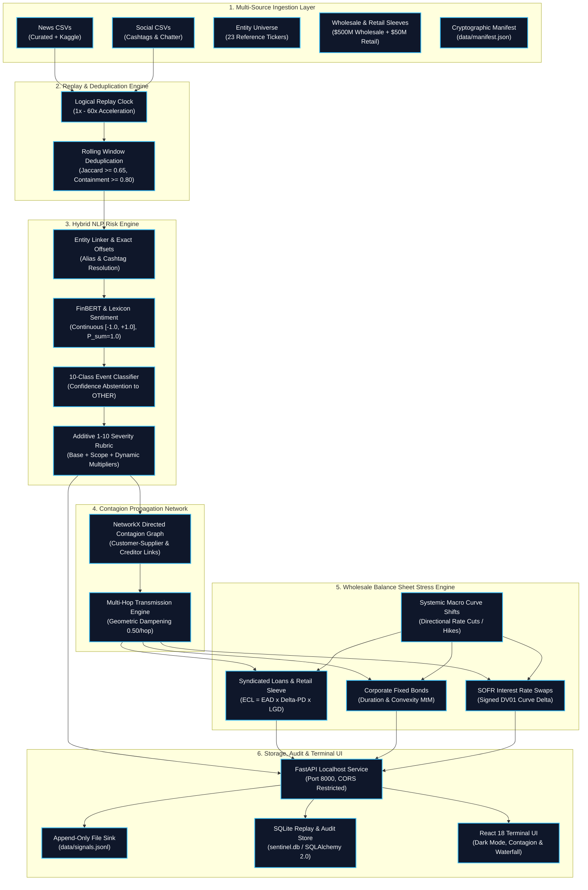

# S&P Sentinel — Architectural Specification

**Project:** S&P Sentinel (S&P Global & CRISIL Campus Hackathon 2026)  
**Candidate:** Aman Gupta (Indian Institute of Technology Kharagpur)  
**Status:** Fully Operational End-to-End Pipeline  
**Visual Architecture:** [System Architecture Diagram (docs/architecture.png)](architecture.png)

---

## 1. System Architecture Overview

The system architecture diagram below illustrates the fully implemented, offline-first pipeline of S&P Sentinel across all six core subsystems:

---

## 2. Pipeline Subsystems

### 2.1 Multi-Source Ingestion & Data Contracts
- [`src/sentinel/contracts/records.py`](../src/sentinel/contracts/records.py): Strongly-typed `InputRecord` enforcing length validation, source channel enums (`NEWS`, `SOCIAL`, `MANUAL`), and provenance tracking (`timestamp_quality`, `is_synthetic`).
- [`src/sentinel/contracts/signals.py`](../src/sentinel/contracts/signals.py): Standardized `RiskSignal` bundle containing canonical entity reference, sentiment distribution with strict probability sum validation ($P(\text{pos}) + P(\text{neg}) + P(\text{neu}) \approx 1.0$), 10-class event taxonomy with confidence score, additive 1–10 impact severity output, and textual evidence spans.
- [`src/sentinel/contracts/stress.py`](../src/sentinel/contracts/stress.py): Institutional multi-asset wholesale banking models defining syndicated corporate loans, corporate fixed bonds, SOFR interest rate swaps, and cash reserves.

### 2.2 Replay Controller & Deduplication
- [`src/sentinel/replay/clock.py`](../src/sentinel/replay/clock.py): Controlled logical replay clock supporting speed multipliers (1x to 60x) and timeline step controls.
- [`src/sentinel/replay/dedup.py`](../src/sentinel/replay/dedup.py): Dual-mode deduplication enforcing exact canonical key deduplication alongside token Jaccard similarity ($\ge 0.65$) and sub-phrase containment ($\ge 0.80$) within a rolling temporal window.

### 2.3 Hybrid NLP Risk Intelligence
- [`src/sentinel/nlp/entities.py`](../src/sentinel/nlp/entities.py): Case-insensitive alias matching with word-boundary enforcement, true start/end character offsets, and cashtag extraction (`$APEX`, `$TSTEL`).
- [`src/sentinel/nlp/sentiment.py`](../src/sentinel/nlp/sentiment.py): FinBERT and financial domain lexicon hybrid producing continuous scores in $[-1.0, +1.0]$ and validated three-way probability distributions.
- [`src/sentinel/nlp/events.py`](../src/sentinel/nlp/events.py): 10-class financial event classifier (`CREDIT`, `MACRO`, `SUPPLY_CHAIN`, `REGULATORY`, `EARNINGS`, `M_AND_A`, `CYBER`, `ESG`, `PRODUCT`, `OTHER`) with confidence thresholding and abstention.
- [`src/sentinel/nlp/severity.py`](../src/sentinel/nlp/severity.py): Standardized 1–10 impact severity calculation: $\text{Base Severity} + \text{Scope Increment} + \text{Dynamic Multipliers}$.

### 2.4 Contagion Propagation Network
- [`src/sentinel/stress/contagion.py`](../src/sentinel/stress/contagion.py): Directed customer-supplier and creditor transmission linkages modeled in NetworkX from `data/graph_edges.csv`.
- Bounded 2-hop propagation with exponential distance damping ($0.50^{\text{hop}}$) ensuring second-order shocks transmit realistically without runaway amplification.

### 2.5 Wholesale Balance Sheet Stress Valuation (Module B)
- [`src/sentinel/stress/valuation.py`](../src/sentinel/stress/valuation.py):
  - **Syndicated Loans:** Expected Credit Loss adjustments: $\Delta \text{ECL} = \text{EAD} \times \Delta\text{PD} \times \text{LGD}$.
  - **Corporate Bonds:** Modified duration and convexity spread repricing: $\Delta P = -D_{\text{mod}} \times \Delta s + \frac{1}{2} C \times (\Delta s)^2$.
  - **SOFR Interest Rate Swaps:** Signed DV01 curve sensitivity: $\Delta \text{MtM} = \text{DV01} \times \Delta y_{\text{curve}}$.
  - **Retail Credit Sleeve:** Aggregated pooled loan tranches derived from Kaggle transaction data.
  - **Systemic Macro Curve Shifts:** Applies systemic yield curve moves across all positions; handles directional rate cuts vs rate hikes correctly.

### 2.6 Localhost API, Storage & Terminal UI
- [`src/sentinel/api/app.py`](../src/sentinel/api/app.py): FastAPI backend restricted to localhost (`127.0.0.1`, `localhost`).
- [`src/sentinel/api/routes/signals.py`](../src/sentinel/api/routes/signals.py): Real-time signal streaming endpoint with `?since=` ISO-8601 query parameter filtering and literal file sink append to `data/signals.jsonl`.
- [`src/sentinel/api/routes/stress.py`](../src/sentinel/api/routes/stress.py): Crisis scenario trigger endpoint computing full portfolio P&L waterfalls.
- [`frontend/`](../frontend/): React 18 + TypeScript + Vite institutional dark-mode terminal displaying live event streams, entity cards, contagion graph, and stress loss waterfalls.
