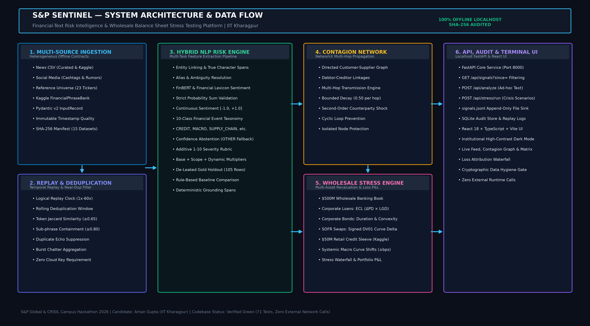

# Architecture

## Components

| Package / script | Responsibility |
|---|---|
| `scripts/data/fetch_real.py` | Build-time download of every real dataset into the gitignored `data/raw/real/` (kagglehub, Hugging Face, SEC, yfinance, GDELT) with checksums |
| `scripts/data/convert_real.py`, `build_universe.py`, `build_credit_sleeve.py`, `build_equity_sleeve.py`, `calibrate_shocks.py` | Committed, contract-compliant samples and derived data, registered in `data/manifest.json` |
| `scripts/live/record_live.py` | Separate real-time recorder: GDELT GKG and SEC 8-K filings appended to `data/live/*.csv` |
| `sentinel.contracts` | Pydantic contracts: `InputRecord`, `RiskSignal`, stress positions and results |
| `sentinel.ingestion` | CSV adapters for news and social records |
| `sentinel.replay` | Logical clock, run controller (sources, badges, live append), exact + MinHash-LSH dedup |
| `sentinel.nlp.entities` | S&P 500 entity linker with exact spans and role guards; `resolve_all` for multi-entity texts |
| `sentinel.nlp.events` | Calibrated event classifier (`models/event_v2.joblib`), abstention, evidence gates, PS-aligned label mapping |
| `sentinel.nlp.sentiment` | Sentiment backends (local FinBERT, `models/sentiment_v2.joblib`, lexicon fallback) and policy/indicator direction |
| `sentinel.nlp.severity`, `impact_model` | Rubric components + market-calibrated impact (`models/impact_v2.joblib`) |
| `sentinel.nlp.relevance` | Social spam / financial-context screening |
| `sentinel.nlp.engine` | Orchestration: one `RiskSignal` per resolved entity, action eligibility and block reasons |
| `sentinel.rebalance` | Module A index rebalancer |
| `sentinel.stress` | Module B: portfolio sleeves, shock catalog (shocks_v2), valuation, contagion, scenarios |
| `sentinel.api` | FastAPI routes: replay, signals, analyze, stress, index, datasets/metrics, SSE events, exports |
| `frontend/` | React terminal: live feed, inspector, Module A and B dashboards, metrics |
| `scripts/run_evaluation.py` | All evaluation suites -> `docs/metrics.json`, `docs/evaluation_report.md`, README table |

## Signal flow

1. A replay source (or the live recorder's files) yields `InputRecord`s ordered by the logical clock.
2. The deduplicator marks exact and near-duplicate copies within a 24-hour window.
3. The engine links every company in the text, scores sentiment and the event once per record, then impact and eligibility per company. Social posts without financial context or with spam markers are blocked.
4. Each `RiskSignal` is stored, appended to `data/signals.jsonl`, pushed over SSE, fed to the Module A rebalancer, and, if it is eligible (supported class, impact > 7, confidence above threshold, not a duplicate), triggers a Module B stress run.

## Runtime boundary

The API process reads only local files and makes no network calls (`scripts/verify_hygiene.py` checks the source). All downloads and live capture happen in scripts that write local files.
