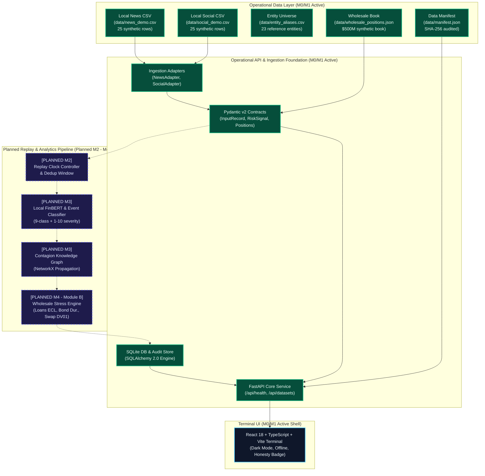

# S&P Sentinel — Architectural Specification

**Project:** S&P Sentinel (S&P Global & CRISIL Campus Hackathon 2026)  
**Candidate:** Aman Gupta (Indian Institute of Technology Kharagpur)  
**Status:** Milestone M0/M1 Operational Foundation  

---

## 1. System Architecture Diagram

The diagram below reflects the strict distinction between currently operational foundation components and planned roadmap milestones, conforming to PRD Section 16.

---

## 2. Operational Foundation Components (M0/M1)

### 2.1 Pydantic v2 Data Contracts
- [`src/sentinel/contracts/records.py`](../src/sentinel/contracts/records.py): Strongly-typed `InputRecord` enforcing minimum character length ($\ge 5$), non-empty content validation, source channel enums (`NEWS`, `SOCIAL`, `MANUAL`), and provenance tracking (`timestamp_quality`, `is_synthetic`).
- [`src/sentinel/contracts/signals.py`](../src/sentinel/contracts/signals.py): Standardized `RiskSignal` bundle containing canonical entity reference, sentiment distribution with strict probability sum validation ($P(\text{pos}) + P(\text{neg}) + P(\text{neu}) \approx 1.0$), 9-class event categorization with confidence score, additive 1–10 impact severity output, and textual evidence spans.
- [`src/sentinel/contracts/stress.py`](../src/sentinel/contracts/stress.py): Institutional multi-asset wholesale banking models defining positions across corporate syndicated loans, corporate bonds, SOFR interest rate swaps, and cash reserves.

### 2.2 Ingestion Adapters
- [`src/sentinel/ingestion/adapters.py`](../src/sentinel/ingestion/adapters.py):
  - `NewsAdapter`: Loads and parses structured financial news CSV records into immutable `InputRecord` contracts.
  - `SocialAdapter`: Ingests financial social commentary, preserving cashtags (`$APEX`, `$QSEM`, `$TSTEL`) and user handles.

### 2.3 Localhost FastAPI Application
- [`src/sentinel/api/app.py`](../src/sentinel/api/app.py): Configured with strict localhost CORS policies (`127.0.0.1`, `localhost`) to prohibit cross-origin leakage.
- [`src/sentinel/api/routes/health.py`](../src/sentinel/api/routes/health.py): Operational health probe reporting engine status, offline verification (`external_apis: false`), database state, and dataset readiness.
- [`src/sentinel/api/routes/datasets.py`](../src/sentinel/api/routes/datasets.py): Serves cryptographic manifest metadata and crisis scenario configurations.

### 2.4 Cryptographic Provenance
- [`data/manifest.json`](../data/manifest.json): Machine-readable catalog specifying row counts, file schemas, project-authored MIT licensing, and SHA-256 checksums for all 10 bundled files.
- [`scripts/verify_hygiene.py`](../scripts/verify_hygiene.py): Automated audit script verifying file integrity against manifest hashes and confirming zero secrets or binaries exist.

---

## 3. Planned Engine Components (M2 through M5 Roadmap)

The following components represent future engineering milestones and are **not yet operational** in M0/M1:

### 3.1 Logical Replay Clock & Event Deduplication (Planned M2)
- Simulates historical event arrival based on `simulated_at` logical timestamps.
- Enforces a 24-hour rolling deduplication window: duplicate mentions of identical events are tagged and suppressed from repeatedly shocking downstream portfolio risk factors.

### 3.2 NLP Risk Engine (Planned M3)
- **Local FinBERT Sentiment:** CPU-optimized PyTorch inference scoring financial text into $[-1.0, +1.0]$ sentiment scores.
- **Event Classifier:** Scikit-learn multi-class event classifier mapping text to the 9 PRD taxonomy classes with explicit abstention (`OTHER`).
- **Impact Severity Scorer:** Additive calculation using Base Score (1–6) + Scope Increment (0–2) + Severity Increment (0–2).

### 3.3 Contagion Knowledge Graph (Planned M3)
- NetworkX directed graph modeling customer-supplier dependencies and credit counterparty links (`data/graph_edges.csv`).
- Bounded 2-hop propagation with exponential distance damping ($0.50^{\text{hop}}$).

### 3.4 Wholesale Portfolio Stress Engine (Module B — Planned M4)
- Primary deliverable for the hackathon: valuation of a synthetic $500M institutional portfolio under crisis scenarios.
- Expected Credit Loss (ECL) on loans, modified duration price approximation on corporate bonds, and signed DV01 sensitivity on interest rate swaps.
